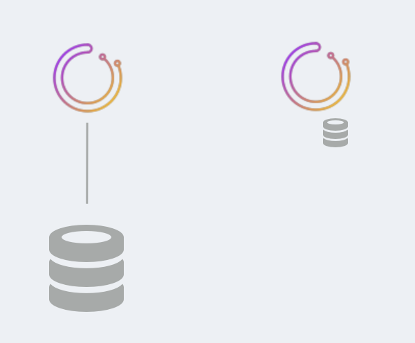
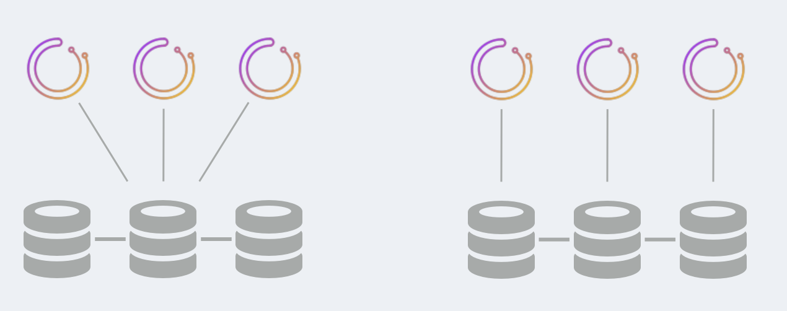
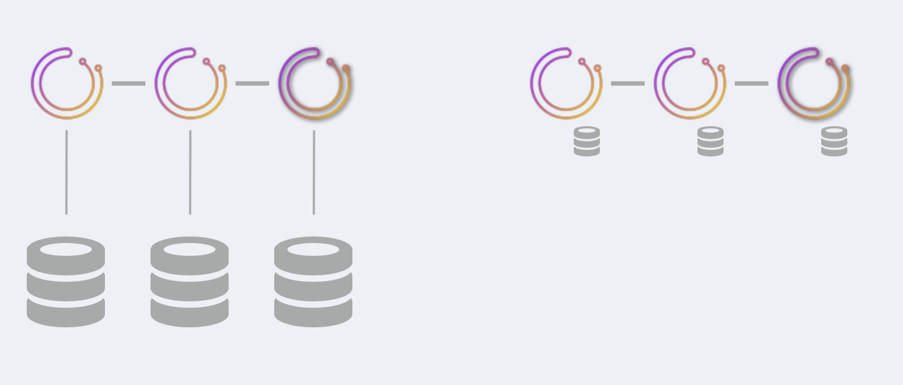
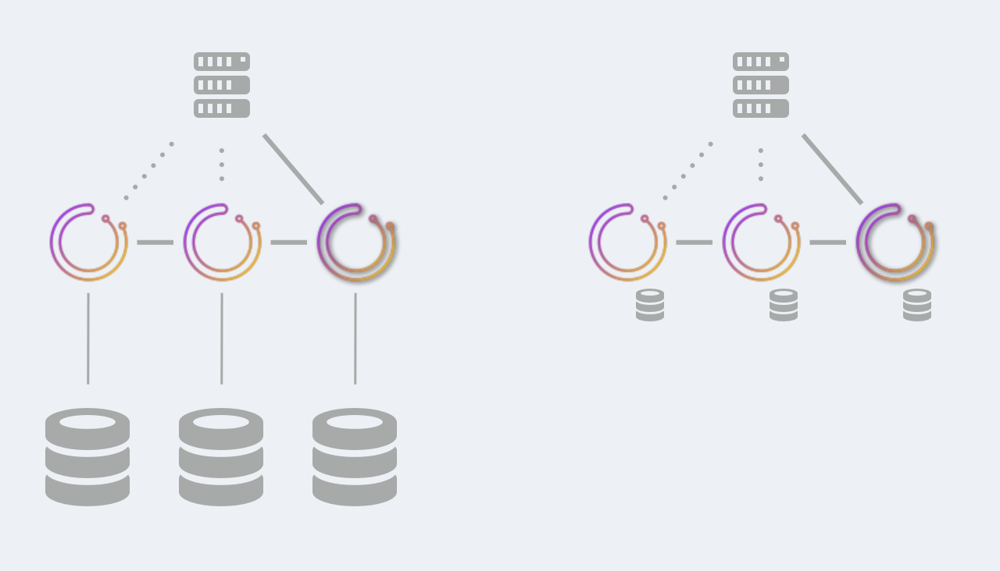

# Orchestrator高可用
# [Orchestrator High Availability](https://github.com/openark/orchestrator/blob/master/docs/high-availability.md)
`orchestrator`作为一个高可用服务运行. 本文列出了为`orchestrator`实现高可用的各种方法, 以及一些less/not高可用的设置.

### TL;DR 实现高可用的方式
HA是通过选择以下其中之一实现的:

* `orchestrator/raft` 模式, `orchestrator`节点间通过raft共识算法通信. 每个`orchestrator`节点都有一个私有的数据库, `MySQL` 或`sqlite` . 另见 [[Orchestrator/raft, consensus cluster id=&#39;355cf04c-56ad-4501-943a-39bbbc59e3bf&#39;]]
* 共享存储(Shared backend)模式. 多个`orchestrator` 节点使用一个后端数据库, 可能是Galera/XtraDB Cluster/InnoDB Cluster/NDB Cluster. (orchestrator的)数据是在数据库层级实现同步的.

另见 [[orchestrator/raft vs. synchronous replication setup id=&#39;c2179792-b277-42c3-bcc0-46ad2548518b&#39;]]

### 高可用类型
你可以根据你的需求，选择不同的可用性类型.

* 无高可用: 最容易、最简单的部署方式, 适合于测试或开发环境. 可以使用`MySQL` 或`sqlite`
* 半高可用(Semi HA): 后端数据库是基于普通主从复制实现的. `orchestrator` does not eat its own dog food, 也不能故障转移自己的后端数据库.
* 高可用: 不会出现单点故障. 不同的解决方案在资源利用、支持的软件、客户端访问类型方面有不同的权衡.

### No high availability

这种部署方式适合CI testing, 本地开发环境或其他实验场景. 本质是一个单一的`orchestrator` 节点和一个单一的数据库节点.

后端数据库可以是`MySQL` 或`sqlite` 数据库, 与`orchestrator` 捆绑在一起（没有依赖性, 不需要额外的软件）

### Semi HA

这种部署方式为`orchestrator` 提供了semi HA能力. 有两种变体可供选择:

* 多个`orchestrator`节点与同一后端数据库对话. (借此方式)`orchestrator` 服务的HA已经实现. 然而, 后端数据库的HA却没有实现. 后端数据库可能是一个带有从库的`主库`, 但`orchestrator`does not eat its own dog food, 也不能故障转移自己的后端数据库.
如果后端主库发生故障，需要有人或其他东西将`orchestrator`服务故障转移到后端数据库的"新主库"上.
* 多个`orchestrator`节点都与proxy对话, proxy实现对后端一套基于`STATEMENT` 格式binlog的双主集群的负载均衡.
   * proxy总是路由到同一个数据库(例如, `HAProxy` 的`first` 算法)除非这个库挂了.
   * active master的宕机导致`orchestrator`与另一个maser对话, 而这个master可能有些落后(复制延迟).  `orchestrator` 通常会根据其持续发现的性质自行重新应用缺失的变化.
   * `orchestrator` 保证了基于`STATEMENT` 的复制不会造成duplicate errors，后端(master-master)双主数据库将始终实现一致性.
   * 即使在运行恢复(指对所管理的MySQL集群运行恢复. 如: Failover)的过程中, `orchestrator` 也能从后端主库宕机中恢复(恢复将在备主上重新启动).
   * **脑裂是可能出现的**. 根据你的设置、物理位置、代理类型, 可能有不同的`orchestrator`服务节点与不同的后端MySQL服务器通话. 这种情况可能导致出现两个认为自己是 "活动 "的`orchestrator`服务, 这两个服务将独立运行故障转移, 这将导致拓扑结构损坏.

要访问您的orchestrator服务, 您可以对任何正常的节点进行通信.

众所周知, 这几种变体都能在生产环境中运行, 适用于非常大的环境.

### HA via shared backend

HA是通过后端数据库的高可用实现的. 现有的解决方案是:

* Galera
* XtraDB Cluster
* InnoDB Cluster
* NDB Cluster

在上述所有情况下，MySQL节点都运行"同步"复制.

> 译者注: 无论Galera还是Group Replication, 都做不到真正的同步. 

存在两种变体:

* 后端 Galera/XtraDB Cluster/InnoDB Cluster 数据库集群使用单主(单点写入)模式. 多个`orchestrator` 节点与writer DB对话, 通常是通过proxy. 如果writer DB出现故障, 后端数据库集群自行完成故障转移, 提升一个新主库作为writer; `orchestrator` 通过proxy识别出来的新主继续提供服务.
* 后端 Galera/XtraDB Cluster/InnoDB Cluster 数据库集群使用多主(多点写入)模式. 一个好的方式是将每个`orchestrator`节点与一个数据库实例结合起来（可能部署在同一个服务器上）. 由于复制是同步的, 所以不存在脑裂的情况. 只有一个`orchestrator`节点可以成为leader, 而且这个leader只会在DB节点的共识下发言.

在这种设置中, MySQL节点之间可能会有大量的流量. 在跨DC的设置中, 这可能意味着更大的提交延迟(每个提交可能需要跨越DC).

要访问你的`orchestrator`服务, 你可以与任何健康的节点对话. 建议你只通过代理与leader对话(使用`/api/leader-check`作为代理的HTTP健康检查).

这种部署方式通常适用于非常大的环境中, 通常会部署3-5个`orchestrator` 节点.

### HA via raft

`orchestrator` 节点将直接通过`raft`共识算法进行通信. 每个`orchestrator`节点都有自己的私有后端数据库. 这可以是`MySQL`或`sqlite` .

只有一个`orchestrator`节点承担领导责任, 并且始终是共识的一部分. 然而, 所有其他节点都是独立活动的, 并且正在对你的拓扑结构进行投票.

在这种模式中:

* DB节点之间没有通信
* `orchestrator`之间的沟通极少.
* `*n倍的`与MySQL拓扑结构节点的通信. 3个节点的设置意味着每个拓扑结构的MySQL服务器都由3个不同的协调器节点独立探测.

建议部署3个或5个节点的集群

`sqlite`被嵌入到`orchestrator`中, 不需要外部依赖. 在负载较高的场景下, `MySQL`的性能优于`sqlite.`

要访问你的`orchestrator`服务, 你只能与leader节点对话.

* Use `/api/leader-check` as HTTP health check for your proxy.

* 或者对多个`orchestrator`后端使用[[orchestrator-client id=c2371d70-81a9-4e29-bc16-a83fa5d40fb8]]; `orchestrator-client`将找出leader并将请求发送给它.

`orchestrator/raft`是一个较新的开发项目, 目前正在生产中进行测试. 请阅读[[Orchestrator/raft, consensus cluster id=&#39;355cf04c-56ad-4501-943a-39bbbc59e3bf&#39;]]以获取更多信息.

> 译者注: 上面这句话是5年前写的了, 可以查看这篇文档的提交记录.

