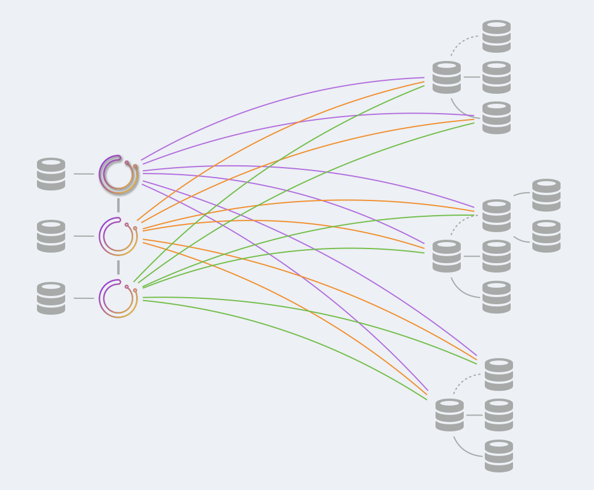

# raft模式部署
# [Orchestrator deployment: raft](https://github.com/openark/orchestrator/blob/master/docs/deployment-raft.md)
本文描述了部署[Orchestrator/raft, consensus cluster](Setup/部署/Orchestrator%20raft%2C%20consensus%20cluster.md)的方法.

这篇文的完善了[在生产环境中部署Orchestrator](Deployment/在生产环境中部署Orchestrator.md).

### Backend DB
你可以选择使用MySQL和SQLite. See[configuration-backend](Setup/配置/Configuration%20%20Backend.md)

* For MySQL:
   * 后端数据库将是独立的. No replication setup. 每个`orchestrator`节点将与自己专用的后端数据库交互.
   * You *must* have a `1:1` mapping `orchestrator:MySQL`.
   * 建议: 请在同一台机器上运行`orchestrator`及其专用的MySQL数据库.
   * 确保在每个后端节点上为`orchestrator`用户`GRANT` privileges.
* For SQLite:
   * SQLite与`orchestrator`捆绑在一起.
   * 确保`orchestrator`用户对`SQLite3DataFile` 有写入权限.

### High availability
利用`raft`实现了`orchestrator`的高可用性. 您不需要考虑后端数据库的高可用性.

### What to deploy: service
* 将`orchestrator`服务部署到service boxes上. 正如所建议的, 您可能希望将`orchestrator`服务和`MySQL`服务放在同一个机器上. If using `SQLite` there's nothing else to do.
* 考虑在服务盒(service boxes)之上增加一个代理(proxy); 代理将把所有流量重定向到leader node(这里指的是`orchestrator` 服务leader节点). 有一个而且只有一个领导者节点, 状态检查的端点是`/api/leader-check` .
   * 客户端将只与健康的raft节点交互.
      * 最简单的方法就是只与leader互动. 设置代理proxy是确保这一点的一种方法. See [[Proxy: leader id=355cf04c-56ad-4501-943a-39bbbc59e3bf]] .
      * 否则，所有健康的raft节点将反向代理您的请求到leader. See [[Proxy: healthy raft nodes id=355cf04c-56ad-4501-943a-39bbbc59e3bf]] .
* 任何东西都不应该直接与后端DB交互. 只有leader有能力与其他raft节点协调对数据的更改.
* `orchestrator`节点之间通过`DefaultRaftPort`进行通信. 该端口应该对所有`orchestrator`节点开放, 其他任何人都不需要访问该端口.

### What to deploy: client
为了从shell/automation/scripts与`orchestrator`进行交互, 你可以选择:

* 直接与HTTP API交互
   * 你只能和leader互动. 实现这一点的一个好方法是使用代理.
* 使用[orchestrator-client](Use/orchestrator-client.md)脚本([orchestrator-client](Use/orchestrator-client.md)本质是一个shell脚本).
   * 将`orchestrator-client`部署在你希望与`orchestrator`交互的任何盒子上.
   * Create and edit `/etc/profile.d/orchestrator-client.sh` on those boxes to read:

```bash
ORCHESTRATOR_API="http://your.orchestrator.service.proxy:80/api"
```
or

```bash
ORCHESTRATOR_API="http://your.orchestrator.service.host1:3000/api http://your.orchestrator.service.host2:3000/api http://your.orchestrator.service.host3:3000/api"
```
在后一种情况下, 你将提供所有`orchestrator`节点的列表, 而`orchetsrator-client`脚本将自动计算出哪个是leader. 通过这种设置, 你的自动化将不需要代理（尽管你可能仍然希望为Web界面用户使用代理）.

确保 chef/puppet/whatever 的 `ORCHESTRATOR_API` 值能够适应环境的变化.

* `orchestrator`cli将拒绝运行给定的raft设置, 因为它直接与底层数据库交互, 不参与raft的共识, 因此不能确保所有raft成员都能看到它的变化
   * 幸运的是, `orchestrator-client`提供了一个与命令行客户端(指的是orchestrator命令)几乎相同的界面(provides an almost identical interface as the command line client).
   * 你可以通过`--ignore-raft-setup` 强制`orchestrator`cli运行(raft设置). 前提是"你知道你在做什么", 清楚这样操作的风险. 如果你确定要这样做, 那么连接到leader的后端DB更有意义.

### Orchestrator service
如前所述, 只有一个`orchestrator`节点将被选为领导者. 只有领导者会:

* 运行故障恢复

所有节点都:
* 发现（探测）你的MySQL拓扑结构
* 运行故障检测

* Register their own health check 注册自己的健康检查

非leader节点一定不能:

* Run arbitrary command (e.g. `relocate`, `begin-downtime`)  (运行任意命令?)

* Run recoveries per human request. (按人的要求运行恢复)

* 提供HTTP请求(but some endpoints, such as load-balancer and health checks, are valid).

### A visual example


如上图所示, 三个`orchestrator` 组成一个raft cluster, 每个`orchestrator` 节点使用自己的专用数据库(`MySQL`或`SQLite`)

`orchestrator` 节点之间会进行通信.

只有一个`orchestrator` 节点会成为leader.

所有`orchestrator`节点探测整个`MySQL`舰队. 每个`MySQL`server都被每个raft成员探测.

### orchestrator/raft operational scenarios 操作场景
##### A node crashes 一个节点崩溃(如何恢复):
启动节点, 启动MySQL服务, 启动`orchestrator`服务. `orchestrator`服务应该加入`raft`组, 获得最近的快照, 赶上raft复制日志并继续正常运行.

> Start the node, start the `MySQL` service if applicable, start the `orchestrator` service. The `orchestrator` service should join the `raft` group, get a recent snapshot, catch up with `raft` replication log and continue as normal.

##### A new node is provisioned / a node is re-provisioned 分配一个新节点/重新分配一个节点:
Such that the backend database is completely empty/missing. 分配/重新分配时后端数据库其实是没有数据或者丢失数据的

* 如果后端数据库是`SQLite`, 则什么也不需要做. 该节点会加入raft group, 从一个active node获得snapshot, 追raft log然后正常运行.
* 如果后端数据库是`MySQL` , 也会尝试像上面那样做. 然而, `orchestrator` 需要有权限操作`MySQL` ,详见[[MySQL backend DB setup id=51d20469-439a-451a-a336-6726cff3a142]] .  因此, 如果这是一个全新的服务器, 这些权限可能不存在. 例如, 我们的`puppet`设置会定期确保在我们的MySQL服务器上设置权限. 因此, 当新服务器被配置时, 下一次`puppet`运行会为`orchestrator`设置权限. `puppet`还确保`orchestrator`服务正在运行, 因此, 在一段时间内, `orchestrator`可以自动加入组.

##### Cloning is valid
如果你选择这样做, 你也可以通过使用你喜欢的备份/恢复或转储/加载方法克隆你现有的后台数据库来配置新的盒子.

这是完全有效的, 尽管不是必须的.

* 如果后端数据库是`MySQL` , 运行备份/恢复, 逻辑物理都行.
* 如果后端数据库是`SQLite` , 运行`.dump` + 恢复, see [10. Converting An Entire Database To An ASCII Text File](https://sqlite.org/cli.html).
* 启动`orchestrator` 服务.  它应该赶上`raft`复制日志并加入`raft`集群.

##### Replacing a node
假设 `RaftNodes: ["node1", "node2", "node3"]` , 你希望使用`nodeX` 替换`node3` .

* 你可以关闭`node3` , 只要`node1` 和`node2` 是正常的, raft cluster就能正常运行.
* 创建`nodeX` , 生成后端数据库数据(见上文).
* 在`node1` , `node2` 和`nodeX` 重新配置`RaftNodes: ["node1", "node2", "nodeX"]` .
* 在`nodeX` 启动`orchestrator` .  它将被拒绝, 不会加入集群, 因为`node1`和`node2`还没有意识到这个变化.
* 在`node1` 重启`orchestrator` .
* 在`node2` 重启`orchestrator` .
   * 这时, 所有三个节点应该形成一个快乐的集群
