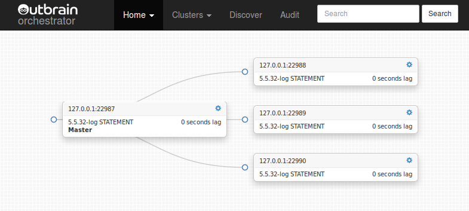

# About
# [About Orchestrator](https://github.com/openark/orchestrator/blob/master/docs/about.md)
`Orchestrator`是一个MySQL复制拓扑结构HA、管理和可视化工具, 可以实现:

#### Discovery
`orchestrator`会主动抓取你的拓扑结构并进行映射. 它读取基本的MySQL信息, 如复制状态和配置.

它为你的拓扑结构提供了灵活的可视化, 包括复制问题，甚至在面对故障时也是如此。

#### Refactoring
`orchestrator`了解复制规则. 它知道binlog file:position, GTID, Pseudo GTID, Binlog Servers.

Refactoring replication topologies can be a matter of drag & drop a replica under another master. Moving replicas around becomes safe: `orchestrator` will reject an illegal refactoring attempt.

通过各种命令行选项来实现细化控制.

> Find grained control is achieved by various command line options.

#### Recovery
`Orchestrator`使用一种整体方法来检测master和intermediate master的故障. 基于从拓扑结构本身获得的信息, 它能识别各种故障情况

Configurable, it may choose to perform automated recovery (or allow the user to choose type of manual recovery). Intermediate master recovery achieved internally to `orchestrator`. Master failover supported by pre/post failure hooks.

恢复过程利用了`orchestrator`对拓扑结构的理解和执行重构的能力. 它基于状态而非配置: `orchestrator`通过在恢复时调查/评估拓扑结构本身来选择最佳恢复方法.

> Recovery process utilizes *orchestrator's* understanding of the topology and of its ability to perform refactoring. It is based on *state* as opposed to *configuration*: `orchestrator` picks the best recovery method by investigating/evaluating the topology at the time of recovery itself.

#### Credits, attributions
Authored by [Shlomi Noach](https://github.com/shlomi-noach)

This project was originally initiated at [Outbrain](http://outbrain.com/), who were kind enough to release it as open source from its very beginning. We wish to recognize Outbrain for their support of open source software and for their further willingness to collaborate to this particular project's success.

The project was later developed at [Booking.com](http://booking.com/) and the company was gracious enough to release further changes into the open source.

At this time the project is being developed at [GitHub](http://github.com/). We will continue to keep it open and supported.

The project accepts pull-requests and encourages them. Thank you for any improvement/assistance!

Additional collaborators & contributors to this Wiki:

* [grierj](https://github.com/grierj)
* Other awesome people