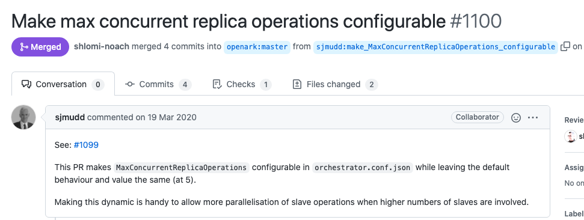
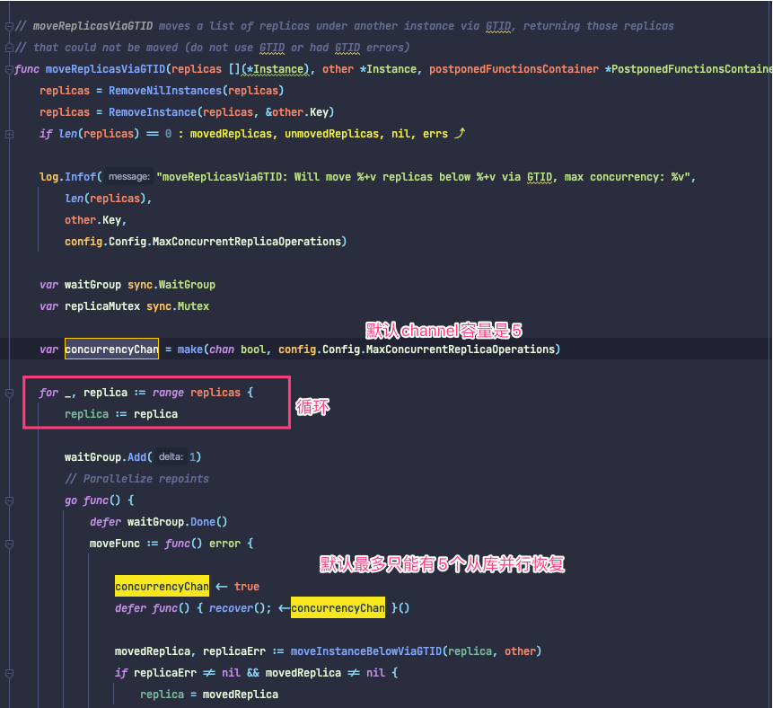

# 配置参数详解-III
## ApplyMySQLPromotionAfterMasterFailover
类型: `bool`

默认值: `true`

当为`true` 时, `orchestrator` 将在选举出的新主库上执行`reset slave all` 和`set read_only=0` . 默认: `true` . 当该参数为`true` 时, 将覆盖`MasterFailoverDetachSlaveMasterHost` .

> Should orchestrator take upon itself to apply MySQL master promotion: set read\_only=0, detach replication, etc.

另见[[Configuration: Recovery id=&#39;1e244518-4a10-46c4-81b5-2da1c8998295&#39;]]

## PreventCrossDataCenterMasterFailover
类型: `bool`

默认值: `false`

默认`false` . 当为`true` 时, `orchestrator`将只用与故障集群主库位于同一DC的从库替换故障的主库. 它将尽最大努力从同一DC中找到一个替代者, 如果找不到, 将中止（失败）故障转移. 另请参阅[[DetectDataCenterQuery id=758fdd72-feac-4c95-84ea-86c51c0fafe9]]和[[DataCenterPattern id=112feef8-f2b2-4612-856d-fb4f76ab2a73]]配置置变量.

> When true (default: false), cross-DC master failover are not allowed, orchestrator will do all it can to only fail over within same DC, or else not fail over at all.

## PreventCrossRegionMasterFailover
类型: `bool`

默认值: `false`

默认`false` . 当为`true` 时, `orchestrator`将只用与故障集群主库位于同一region的从库替换故障的主库. 它将尽最大努力找到同一region的替代者, 如果找不到, 将中止（失败）故障转移. 另请参阅[[DetectRegionQuery id=112feef8-f2b2-4612-856d-fb4f76ab2a73]]和[[RegionPattern id=112feef8-f2b2-4612-856d-fb4f76ab2a73]]配置变量.

> When true (default: false), cross-region master failover are not allowed, orchestrator will do all it can to only fail over within same region, or else not fail over at all.

## MasterFailoverLostInstancesDowntimeMinutes
类型: `uint`

默认值: `0`

个人理解为一个"置为下线"的时间. 一个节点发生或failover后, 不应该立即再次进行恢复(他这里包括主库又挂了, 和从库丢失). 

> MHA也有类似机制, 默认8小时内不能再次failover

> Number of minutes to downtime any server that was lost after a master failover (including failed master & lost replicas). 0 to disable

这个参数在源码里已经没有地方使用了.. [commit记录](https://github.com/openark/orchestrator/commit/76f3ae3cdb9b4db98a00dcd03a716a6637972051), 但是没找到什么时候删掉的

## MasterFailoverDetachSlaveMasterHost
类型: `bool`

默认值: `false`

当该参数为`true` 时, `orchestrator`将对被选举为新主库的节点执行`detach-replica-master-host`（这确保了即使旧主库"复活了", 新主库也不会试图从旧主库复制数据）. 默认值: `false`. 如果[[ApplyMySQLPromotionAfterMasterFailover id=41d34469-00db-4a66-a339-b914d7dc6702]]为真，这个参数将失去意义. [[MasterFailoverDetachReplicaMasterHost id=41d34469-00db-4a66-a339-b914d7dc6702]]是它的一个别名.

## MasterFailoverDetachReplicaMasterHost
类型: `bool`

默认值: `false`

当该参数为`true` 时, `orchestrator`将对被选举为新主库的节点执行`detach-replica-master-host`（这确保了即使旧主库"复活了", 新主库也不会试图从旧主库复制数据）. 默认值: `false`. 如果[[ApplyMySQLPromotionAfterMasterFailover id=41d34469-00db-4a66-a339-b914d7dc6702]]为真，这个参数将失去意义. 

> Should orchestrator issue a detach-replica-master-host on newly promoted master (this makes sure the new master will not attempt to replicate old master if that comes back to life). Defaults 'false'. Meaningless if ApplyMySQLPromotionAfterMasterFailover is 'true'.

## FailMasterPromotionOnLagMinutes
类型: `uint`

默认值: `0`

默认`0` (not failing promotion). 如果候选replica落后太多, 该参数可以用于将选举置为失败状态. 例如: 由于种种原因从库(候选主库)故障了5个小时(数据存在5小时延迟), 随后, 主库出现故障. 这种情况下, 我们可能希望阻止failover, 以便恢复那5个小时的复制延迟. 要使用这个参数, 你必须设置`ReplicationLagQuery` 并使用类似于`pt-heatbeat` 的心跳机制. 因为当复制故障时, `SHOW SLAVE STATUS` 中的`Seconds_behind_master` 不会显示延迟(会显示为Null).

> when > 0, fail a master promotion if the candidate replica is lagging >= configured number of minutes.

## FailMasterPromotionIfSQLThreadNotUpToDate
类型: `bool`

默认值: `false`

如果在故障发生时, 所有的从库都是滞后的, 即使是拥有最新数据的、被选举为新主库的候选节点也可能有未应用的中继日志. 在这样的节点上执行`reset slave all`会丢失中继日志数据. 当这个参数为true是, promotion is aborted with error

> when true, and a master failover takes place, if candidate master has not consumed all relay logs, promotion is aborted with error

## DelayMasterPromotionIfSQLThreadNotUpToDate
类型: `bool`

默认值: `false`

如果在故障发生时, 所有的从库都是滞后的, 即使是拥有最新数据的、被选举为新主库的候选节点也可能有未应用的中继日志. 当该参数为`true` 时, `orchestrator` 将等待SQL thread应用完所有relay log, 然后再将候选从库提升为新主库. [[FailMasterPromotionIfSQLThreadNotUpToDate id=41d34469-00db-4a66-a339-b914d7dc6702]]和[[DelayMasterPromotionIfSQLThreadNotUpToDate id=41d34469-00db-4a66-a339-b914d7dc6702]]是相互排斥的.

> when true, and a master failover takes place, if candidate master has not consumed all relay logs, delay promotion until the sql thread has caught up

## PostponeSlaveRecoveryOnLagMinutes
类型: `uint`

默认值: `0`

在崩溃恢复时, 延迟超过给定分钟的副本只会在恢复过程的后期恢复, 在 master/intermediate master 被选择并执行进程之后.  值 0 禁用此功能.  默认值: 0.  是[[PostponeReplicaRecoveryOnLagMinutes id=41d34469-00db-4a66-a339-b914d7dc6702]]的别名.

## PostponeReplicaRecoveryOnLagMinutes
类型: `uint`

默认值: `0`

在崩溃恢复时, 延迟超过给定分钟的副本只会在恢复过程的后期恢复, 在 master/intermediate master 被选择并执行进程之后.  值 0 禁用此功能.  默认值: 0.  `PostponeSlaveRecoveryOnLagMinutes` 是它的别名.

> On crash recovery, replicas that are lagging more than given minutes are only resurrected late in the recovery process, after master/IM has been elected and processes executed. Value of 0 disables this feature

## OSCIgnoreHostnameFilters
类型: `[]string`

默认值: `[]string{}`

直译: OSC 副本建议将忽略与给定模式匹配的副本主机名

> OSC replicas recommendation will ignore replica hostnames matching given patterns

官方文档没有介绍此参数.

源码`go/inst/instance_dao.go`

```go
// filterOSCInstances will filter the given list such that only replicas fit for OSC control remain.
// filterOSCInstances将过滤给定的列表，以便只保留适合OSC控制的副本。
func filterOSCInstances(instances [](*Instance)) [](*Instance) {
	result := [](*Instance){}
	for _, instance := range instances {
		if FiltersMatchInstanceKey(&instance.Key, config.Config.OSCIgnoreHostnameFilters) {
                  // FiltersMatchInstanceKey 这个代码之前看过, 他会先迭代filters, 判断每个元素值是否为ip地址
                  // 如果是, 精确匹配, 如果不是, 则将其视为正则表达式进行匹配
                  // 匹配, 丢弃
			continue
		}
		if instance.IsBinlogServer() {
                  // 是binlogserver, 丢弃
			continue
		}
		if !instance.IsLastCheckValid {
                  // 最后一次check is not valid, 丢弃
			continue
		}
		result = append(result, instance)
	}
	return result
}
```
filterOSCInstances被GetClusterOSCReplicas调用

```go
// GetClusterOSCReplicas returns a heuristic list of replicas which are fit as controll replicas for an OSC operation.
// These would be intermediate masters
func GetClusterOSCReplicas(clusterName string) ([](*Instance), error) {
```
调用GetClusterOSCReplicas的有三处

* which-cluster-osc-replicas 命令

```go
	case registerCliCommand("which-cluster-osc-replicas", "Information", `Output a list of replicas in a cluster, that could serve as a pt-online-schema-change operation control replicas`):
		{
			clusterName := getClusterName(clusterAlias, instanceKey)
			instances, err := inst.GetClusterOSCReplicas(clusterName)
			if err != nil {
				log.Fatale(err)
			}
			for _, clusterInstance := range instances {
				fmt.Println(clusterInstance.Key.DisplayString())
			}
		}
```
* ClusterOSCReplicas函数

```go
// ClusterOSCReplicas returns heuristic list of OSC replicas
func (this *HttpAPI) ClusterOSCReplicas(params martini.Params, r render.Render, req *http.Request) {
	clusterName, err := figureClusterName(getClusterHint(params))
	if err != nil {
		Respond(r, &APIResponse{Code: ERROR, Message: fmt.Sprintf("%+v", err)})
		return
	}

	instances, err := inst.GetClusterOSCReplicas(clusterName)
	if err != nil {
		Respond(r, &APIResponse{Code: ERROR, Message: fmt.Sprintf("%+v", err)})
		return
	}

	r.JSON(http.StatusOK, instances)
}
```
* GetClusterHeuristicLag函数

```go
// GetClusterHeuristicLag returns a heuristic lag for a cluster, based on its OSC replicas
func GetClusterHeuristicLag(clusterName string) (int64, error) {
	instances, err := GetClusterOSCReplicas(clusterName)
	if err != nil {
		return 0, err
	}
	return GetInstancesMaxLag(instances)
}
```
### 先看`which-cluster-osc-replicas` 的作用
```javascript
  Output a list of replicas in same cluster as given instance, that would server as good candidates as control replicas
  for a pt-online-schema-change operation.
  Those replicas would be used for replication delay so as to throtthe osc operation. Selected replicas will include,
  where possible: intermediate masters, their replicas, 3rd level replicas, direct non-intermediate-master replicas.

  orchestrator -c which-cluster-osc-replicas -i instance.to.check.com

  orchestrator -c which-cluster-osc-replicas
      -i not given, implicitly assumed local hostname

  orchestrator -c which-cluster-osc-replicas -alias some_alias
      assuming some_alias is a known cluster alias (see ClusterNameToAlias or DetectClusterAliasQuery configuration)
```
输出与给定实例相同的集群中的副本列表, 该列表将作为 pt-online-schema-change 操作的控制副本作为良好的候选服务器.

这些副本将用于复制延迟, 以限制 osc 操作. 在可能的情况下, 选定的副本将包括: 中间主副本、它们的副本、第 3 级副本、直接非中间主副本.

真相大白了, 原来是给pt-osc用的. 就是给pt-osc一个从库列表, 用来监控复制延迟呗

> 那应该还有给gh-ost用的

### ClusterOSCReplicas
```javascript
this.registerAPIRequest(m, "cluster-osc-slaves/:clusterHint", this.ClusterOSCReplicas)
```
这就是个接口.  和上面那个命令一样.

### GetClusterHeuristicLag
```javascript
	case registerCliCommand("get-cluster-heuristic-lag", "Information", `For a given cluster (indicated by an instance or alias), output a heuristic "representative" lag of that cluster`):
		{
			clusterName := getClusterName(clusterAlias, instanceKey)
			lag, err := inst.GetClusterHeuristicLag(clusterName)
			if err != nil {
				log.Fatale(err)
			}
			fmt.Println(lag)
		}
```
get-cluster-heuristic-lag命令作用

```javascript
  For a given cluster (indicated by an instance or alias), output a heuristic "representative" lag of that cluster.
  The output is obtained by examining the replicas that are member of "which-cluster-osc-replicas"-command, and
  getting the maximum replica lag of those replicas. Recall that those replicas are a subset of the entire cluster,
  and that they are ebing polled periodically. Hence the output of this command is not necessarily up-to-date
  and does not represent all replicas in cluster. Examples:

  orchestrator -c get-cluster-heuristic-lag -i instance.that.is.part.of.cluster.com

  orchestrator -c get-cluster-heuristic-lag
      -i not given, implicitly assumed local host, cluster implied

  orchestrator -c get-cluster-heuristic-lag -alias some_alias
      assuming some_alias is a known cluster alias (see ClusterNameToAlias or DetectClusterAliasQuery configuration)
```
  对于一个给定的集群(由实例或别名表示), 输出一个该集群的启发式 "代表 "滞后.

  该输出是通过检查作为 "which-cluster-osc-replicas "命令成员的副本来获得的, 并获得这些副本的最大延迟.

  得到这些副本的最大延迟. 回顾一下, 这些副本是整个集群的一个子集.

  而且它们是定期轮询的. 因此, 这个命令的输出不一定是最新的, 并不代表集群中的所有副本

## GraphiteAddr
类型: `string`

默认值: `""`

指的是[Graphite监控](https://graphiteapp.org/) 地址. 如果配置了这个参数, orch的metrics会自动写到这个地址

> Optional; address of graphite port. If supplied, metrics will be written here

## GraphitePath
类型: `string`

默认值: `""`

graphite路径的前缀. 可以包括{hostname}魔法占位符

> Prefix for graphite path. May include {hostname} magic placeholder

## GraphiteConvertHostnameDotsToUnderscores
类型: `bool`

默认值: `true`

如果为真, 在用于graphite path前, hostname中的`.` 将被替换为`_` 

> If true, then hostname's dots are converted to underscores before being used in graphite path

## GraphitePollSeconds
类型: `int`  为啥不是uint

默认值: `60`

监控数据写入的间隔. 0禁用

> Graphite writes interval. 0 disables.

## URLPrefix
类型: `string`

默认值: `""`

URL prefix to run orchestrator on non-root web path, e.g. /orchestrator to put it behind nginx.

代码中会确保前缀以"/"开头, 且没有后缀.

```go
    if this.URLPrefix != "" {
        // Ensure the prefix starts with "/" and has no trailing one.
        this.URLPrefix = strings.TrimLeft(this.URLPrefix, "/")
        this.URLPrefix = strings.TrimRight(this.URLPrefix, "/")
        this.URLPrefix = "/" + this.URLPrefix
    }
```
## DiscoveryIgnoreReplicaHostnameFilters
类型: `[]string`

默认值: `[]string{}`

Discovery从库时会忽略改列表中正则匹配的主机. 比如orch和列表中的从库网络不通, 导致无法完成发现, 或者类型DM, canal等伪装成slave的组件, 他们也不需要被"发现"

> Regexp filters to apply to prevent auto-discovering new replicas. Usage: unreachable servers due to firewalls, applications which trigger binlog dumps

## DiscoveryIgnoreMasterHostnameFilters
类型: `[]string`

默认值: `[]string{}`

Discovery主库时会忽略改列表中正则匹配的主机. 列入, 你的主库需要暂时从其他机器复制一些数据, 那么可以将该主库临时添加到这个列表

> Regexp filters to apply to prevent auto-discovering a master. Usage: pointing your master temporarily to replicate some data from external host

## DiscoveryIgnoreHostnameFilters
类型: `[]string`

默认值: `[]string{}`

Discovery时会忽略改列表中正则匹配的主机.

> Regexp filters to apply to prevent discovering instances of any kind

## ConsulAddress
类型: `string`

默认值: `""`

Consul地址

> Address where Consul HTTP api is found. Example: 127.0.0.1:8500

## ConsulScheme
类型: `string`

默认值: `http`

Scheme (http or https) for Consul

## ConsulAclToken
类型: `string`

默认值: `""`

ACL token used to write to Consul KV

## ConsulCrossDataCenterDistribution
类型: `bool`

默认值: `false`

详见[[Consul specific id=df7404f7-5427-4861-af1c-f5a706280b7d]] 

> should orchestrator automatically auto-deduce all consul DCs and write KVs in all DCs

## ConsulKVStoreProvider
类型: `string`

默认值: `consul`

详见[[Consul Transaction support id=df7404f7-5427-4861-af1c-f5a706280b7d]] 

> Consul KV store provider (consul or consul-txn), default: "consul"

## ConsulMaxKVsPerTransaction
类型: `int`

默认值: `5`

详见[[Consul Transaction support id=df7404f7-5427-4861-af1c-f5a706280b7d]] 

> Maximum number of KV operations to perform in a single Consul Transaction. Requires the "consul-txn" ConsulKVStoreProvider

## ZkAddress
类型: `string`

默认值: `""`

zookeeper地址. 注释写着还不支持. 但是看着已经有一些代码了. 不清楚

> UNSUPPERTED YET. Address where (single or multiple) ZooKeeper servers are found, in \`srv1\[:port1\]\[,srv2\[:port2\]...\]\` format. Default port is 2181. Example: srv-a,srv-b:12181,srv-c

## KVClusterMasterPrefix
类型: `string`

默认值: `mysql/master`

KV store中集群主库前缀

> Prefix to use for clusters' masters entries in KV stores (internal, consul, ZK), default: "mysql/master"

## WebMessage
类型: `string`

默认值: `""`

如果提供, 将显示在所有网页的标题栏下方

> If provided, will be shown on all web pages below the title bar

## MaxConcurrentReplicaOperations
类型: `int`

默认值: `5`

replica上的最大并发操作数

> Maximum number of concurrent operations on replicas

PR [https://github.com/openark/orchestrator/pull/1100](https://github.com/openark/orchestrator/pull/1100)





## EnforceExactSemiSyncReplicas
类型: `bool`

默认值: `false`

决定是否执行严格的半同步复制拓扑结构的标志. 如果启用, `LockedSemiSyncMaster`和`MasterWithTooManyReplicas`的恢复将在副本上启用和禁用半同步, 以根据优先级顺序完全匹配所需的拓扑结构.

> If true, semi-sync replicas will be enabled/disabled to match the wait count in the desired priority order; this applies to LockedSemiSyncMaster and MasterWithTooManySemiSyncReplicas

另见[[Semi-sync replicas (rpl\_semi\_sync\_slave\_enabled) id=b169c092-dcf3-4fe9-87ce-8cbe95b331e1]] 和 [[Failure detection id=&#39;78787f6a-1f80-4d86-a3ba-e1a0e5993eae&#39;]]

## RecoverLockedSemiSyncMaster
类型: `bool`

默认值: `false`

决定是否从`LockedSemiSyncMaster`情况下恢复的标志. 如果启用, `LockedSemiSyncMaster`的恢复将按照优先级顺序在副本上启用（但绝不会禁用）半同步, 以匹配主库的等待计数(rpl\_semi\_sync\_master\_wait\_for\_slave\_count). 如果[[EnforceExactSemiSyncReplicas id=41d34469-00db-4a66-a339-b914d7dc6702]]被设置了, 这个选项就没有效果. 如果你想只处理半同步复制太少的情况, 而不是太多的话, 这个选项很有用.

> If true, orchestrator will recover from a LockedSemiSync state by enabling semi-sync on replicas to match the wait count; this behavior can be overridden by EnforceExactSemiSyncReplicas

另见[[Semi-sync replicas (rpl\_semi\_sync\_slave\_enabled) id=b169c092-dcf3-4fe9-87ce-8cbe95b331e1]] 和 [[Failure detection id=&#39;78787f6a-1f80-4d86-a3ba-e1a0e5993eae&#39;]]

## ReasonableLockedSemiSyncMasterSeconds
类型: `uint`

默认值: 与[[ReasonableReplicationLagSeconds id=509ce608-cd95-4ec4-9fbd-02f8e01e6ca2]]相同

触发`LockedSemiSyncMaster`条件的秒数; 如果没有设置, 则退回到`ReasonableReplicationLagSeconds` .

> Time to evaluate the LockedSemiSyncHypothesis before triggering the LockedSemiSync analysis; falls back to ReasonableReplicationLagSeconds if not set

```go
    if this.ReasonableLockedSemiSyncMasterSeconds == 0 {
        this.ReasonableLockedSemiSyncMasterSeconds = uint(this.ReasonableReplicationLagSeconds)
    }
```
另见[[Semi-sync replicas (rpl\_semi\_sync\_slave\_enabled) id=b169c092-dcf3-4fe9-87ce-8cbe95b331e1]] 和 [[Failure detection id=&#39;78787f6a-1f80-4d86-a3ba-e1a0e5993eae&#39;]]

