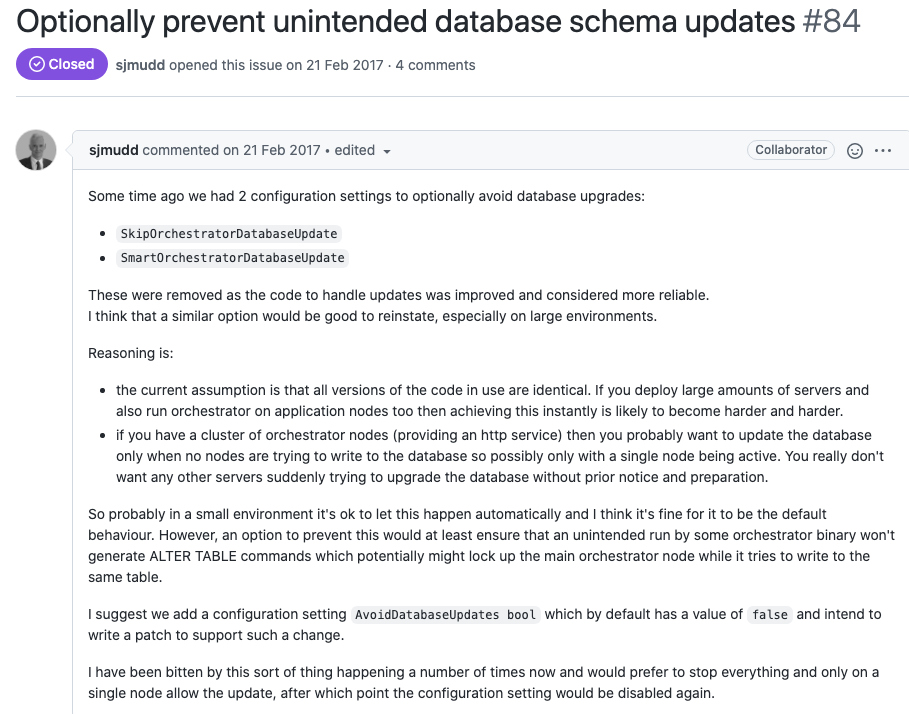
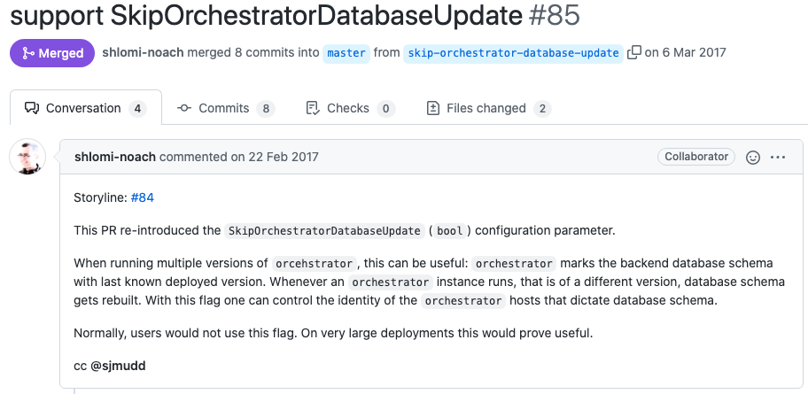
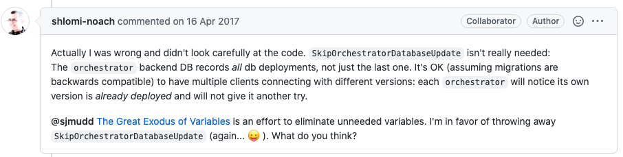
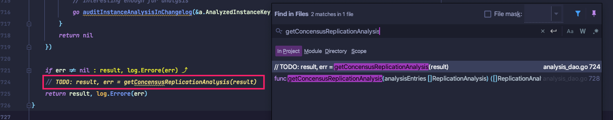
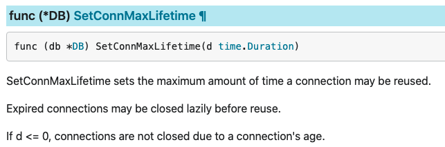
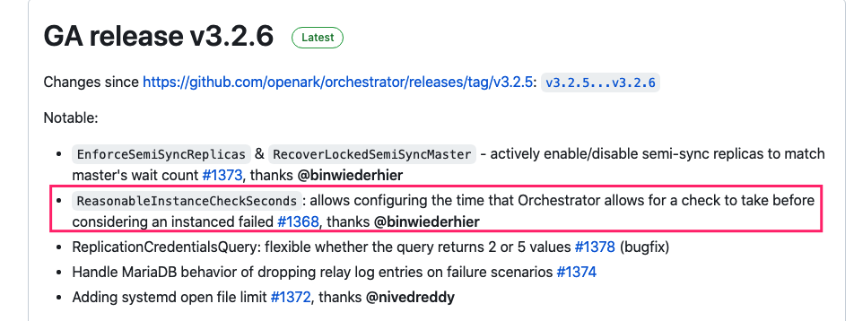
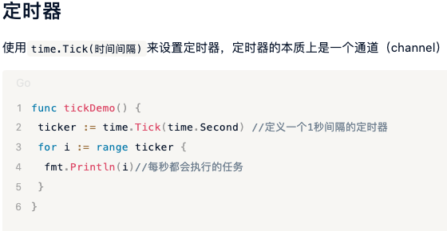
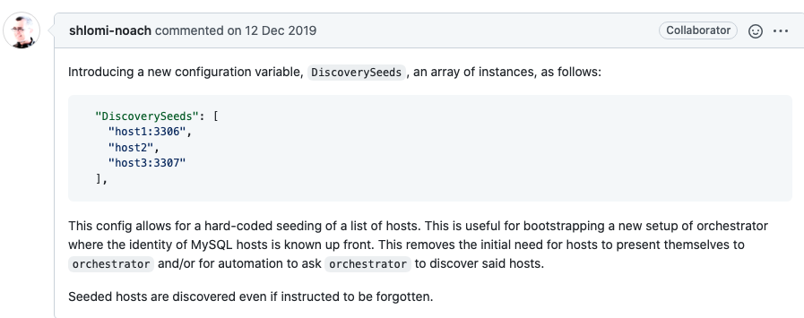

# 配置参数详解-Ⅰ
`orchestrator/conf` 下有几个实例配置文件

* orchestrator-ci-env.conf.json
* orchestrator-ci-upgrade.conf.json
* orchestrator-raft-env.conf.json
* orchestrator-sample.conf.json
* orchestrator-sample-sqlite.conf.json
* orchestrator-simple.conf.json

simple和sample区别不大.

参数的解释都在`go/config/config.go` 中. `Configuration` 结构体定义了所有参数. 默认值见`newConfiguration()`

## Debug
类型: `bool`

默认值: `false`

是否开启Debug模式.

> set debug mode (similar to --debug option)

## EnableSyslog
类型: `bool`

默认值: `false`

是否把日志输出到系统日志里.  

> Should logs be directed (in addition) to syslog daemon?

源码`go/cmd/orchestrator/main.go`

```go
	if config.Config.EnableSyslog {
		log.EnableSyslogWriter("orchestrator")
		log.SetSyslogLevel(log.INFO)
	}
```
## ListenAddress
类型: `string`

默认值: `":3000"`

orchestrator HTTP tcp监听端口.

> Where orchestrator HTTP should listen for TCP

## ListenSocket
类型: `string`

默认值: `""`

orchestrator HTTP应该监听unix socket的地方(默认: 空; 当给出时, TCP被禁用)

>  Where orchestrator HTTP should listen for unix socket (default: empty; when given, TCP is disabled)

## HTTPAdvertise
类型: `string`

默认值: `""`

不太懂, 应该是用不上.

> optional, for raft setups, what is the HTTP address this node will advertise to its peers (potentially use where behind NAT or when rerouting ports; example: "http://11.22.33.44:3030")

> 	

详见[[NAT, firewalls, routing id=02ad8b7b-1cf4-4925-9233-1bd744018d25]]

## AgentsServerPort
类型: `string`

默认值: `":3001"`

orchestrator agents回调时访问的端口

> port orchestrator agents talk back to

另见[Agents](Various/Agents.md)

## MySQLTopologyUser
类型: `string`

默认值: `""`

被管理的MySQL的用户

另见[Configuration: Basic Discovery](Setup/配置/Configuration%20%20Basic%20Discovery.md)

## MySQLTopologyPassword
类型: `string`

默认值: `""`

被管理的MySQL的用户的密码(明文)

另见[Configuration: Basic Discovery](Setup/配置/Configuration%20%20Basic%20Discovery.md)

## MySQLTopologyCredentialsConfigFile
类型: `string`

默认值: `""`

包含被管理的MySQL的用户名密码的my.cnf风格的配置文件.

> my.cnf style configuration file from where to pick credentials. Expecting \`user\`, \`password\` under \`\[client\]\` section

源码`go/config/config.go`

`postReadAdjustments` 方法中

```go
	if this.MySQLTopologyCredentialsConfigFile != "" { // 如果定义了参数MySQLTopologyCredentialsConfigFile
		mySQLConfig := struct {
			Client struct {
				User     string
				Password string
			}
		}{}
               // 读取MySQLTopologyCredentialsConfigFile文件. 获取用户名密码
		err := gcfg.ReadFileInto(&mySQLConfig, this.MySQLTopologyCredentialsConfigFile)
		if err != nil {
			log.Fatalf("Failed to parse gcfg data from file: %+v", err)
		} else {
			log.Debugf("Parsed topology credentials from %s", this.MySQLTopologyCredentialsConfigFile)
			this.MySQLTopologyUser = mySQLConfig.Client.User
			this.MySQLTopologyPassword = mySQLConfig.Client.Password
		}
	}
```
而`postReadAdjustments` 被config.read函数调用

```go
func read(fileName string) (*Configuration, error) {
	if fileName == "" {
		return Config, fmt.Errorf("Empty file name")
	}
	file, err := os.Open(fileName)
	if err != nil {
		return Config, err
	}
	decoder := json.NewDecoder(file)
	err = decoder.Decode(Config) // 先解析--config
	if err == nil {
		log.Infof("Read config: %s", fileName)
	} else {
		log.Fatal("Cannot read config file:", fileName, err)
	}
	if err := Config.postReadAdjustments(); err != nil { // 再调用postReadAdjustments
		log.Fatale(err)
	}
	return Config, err
}
```
所以如果定义了`MySQLTopologyCredentialsConfigFile` , 就会忽略`--config`文件中定义的[[MySQLTopologyUser id=509ce608-cd95-4ec4-9fbd-02f8e01e6ca2]]和[[MySQLTopologyPassword id=509ce608-cd95-4ec4-9fbd-02f8e01e6ca2]](如果定义了的话).

## MySQLTopologySSLPrivateKeyFile
类型: `string`

默认值: `""`

用于通过TLS与拓扑结构的mysql实例进行验证的私钥文件

> Private key file used to authenticate with a Topology mysql instance with TLS

另见[[SSL and TLS id=f0c1c523-8161-4969-9e64-db5f21f1211c]]

## MySQLTopologySSLCertFile
类型: `string`

默认值: `""`

用于通过TLS与拓扑结构的mysql实例进行认证的证书PEM文件

> Certificate PEM file used to authenticate with a Topology mysql instance with TLS

另见[[SSL and TLS id=f0c1c523-8161-4969-9e64-db5f21f1211c]]

## MySQLTopologySSLCAFile
类型: `string`

默认值: `""`

用于用TLS认证拓扑结构mysql实例的证书授权PEM文件

> Certificate Authority PEM file used to authenticate with a Topology mysql instance with TLS

```yaml
    "MySQLOrchestratorSSLPrivateKeyFile": "PATH_TO_CERT/orchestrator-database.key",
    "MySQLOrchestratorSSLCertFile": "PATH_TO_CERT/orchestrator-database.crt",
    "MySQLOrchestratorSSLCAFile": "PATH_TO_CERT/ca.pem",
```
另见[[SSL and TLS id=f0c1c523-8161-4969-9e64-db5f21f1211c]]

## MySQLTopologySSLSkipVerify
类型: `bool`

默认值: `false`

如果为true, 不严格验证拓扑结构mysql实例的相互TLS证书

> If true, do not strictly validate mutual TLS certs for Topology mysql instances

另见[[SSL and TLS id=f0c1c523-8161-4969-9e64-db5f21f1211c]]

## MySQLTopologyUseMutualTLS
类型: `bool`

默认值: `false`

打开拓扑结构MySQL实例的TLS认证

> Turn on TLS authentication with the Topology MySQL instances

另见[[SSL and TLS id=f0c1c523-8161-4969-9e64-db5f21f1211c]]

## MySQLTopologyUseMixedTLS
类型: `bool`

默认值: `true`

用拓扑结构的MySQL实例进行混合TLS和非TLS认证

> Mixed TLS and non-TLS authentication with the Topology MySQL instances

另见[[SSL and TLS id=f0c1c523-8161-4969-9e64-db5f21f1211c]]

## TLSCacheTTLFactor
类型: `uint`

默认值: `100`

我们设定为TLS信息缓存到期的`InstancePollSeconds`的系数

> Factor of InstancePollSeconds that we set as TLS info cache expiry

## BackendDB
类型: `string`

默认值: `mysql`

后端数据库的类型; "mysql "或 "sqlite3".

> EXPERIMENTAL: type of backend db; either "mysql" or "sqlite3"

## SQLite3DataFile
类型: `string`

默认值:  `""`

sqlite3数据文件存储路径.

> when BackendDB == "sqlite3", full path to sqlite3 datafile

源码`go/config/config.go`

config.read函数调用`postReadAdjustments` 方法. 而在此方法中有以下定义

```go
	if this.IsSQLite() && this.SQLite3DataFile == "" {
		return fmt.Errorf("SQLite3DataFile must be set when BackendDB is sqlite3")
	}
即如果BackendDB为sqlite, 就必须定义SQLite3DataFile, 否则报错
```
另见[[SQLite backend id=51d20469-439a-451a-a336-6726cff3a142]]

## SkipOrchestratorDatabaseUpdate
类型: `bool`

默认值: `false`

当为真时, 不检查后端数据库模式, 也不尝试更新它. 当你可能运行多个版本的`orchestrator` , 而你只希望某些盒子(这里应该是指某些orchestrator节点)能决定数据库结构时. 这很有用~~(否则任何时候运行不同版本的~~~~orchestrator~~~~都会重建数据库模式) 其实并不会, 详见下面的描述~~

> When true, do not check backend database schema nor attempt to update it. Useful when you may be running multiple versions of orchestrator, and you only wish certain boxes to dictate the db structure (or else any time a different orchestrator version runs it will rebuild database schema)

这个参数其实已经废弃了, 有两个issue:

[Optionally prevent unintended database schema updates #84](https://github.com/openark/orchestrator/issues/84)



`SkipOrchestratorDatabaseUpdate` 其实之前就被删除过. **sjmudd**在2017-02-21建议加回来.

原因是

```Plain Text
我认为恢复类似的选项会很好，尤其是在大型环境中。

原因是：
- 当前的假设是使用的所有代码版本都是相同的。如果您部署大量服务器并也在应用程序节点上运行协调器，那么立即实现这一目标可能会变得越来越难。
- 如果您有一个编排器节点集群（提供 http 服务），那么您可能只想在没有节点尝试写入数据库时​​更新数据库，因此可能只有一个节点处于活动状态。您真的不希望任何其他服务器在没有事先通知和准备的情况下突然尝试升级数据库。
所以可能在一个小的环境中，让它自动发生是可以的，我认为它可以成为默认行为。但是，防止这种情况的选项至少可以确保某些编排器二进制文件的意外运行不会生成 ALTER TABLE 命令，这可能会在尝试写入同一个表时锁定主编排器节点。

我建议我们添加一个配置设置 AvoidDatabaseUpdates bool，默认情况下它的值为 false，并打算编写一个补丁来支持这种更改。

我现在已经被这种事情发生了很多次，并且宁愿停止一切，并且只在一个节点上允许更新，之后配置设置将再次被禁用。
```
随后作者**shlomi-noach** 表示了赞同. 在[support SkipOrchestratorDatabaseUpdate #85](https://github.com/openark/orchestrator/pull/85) 这个PR中恢复了`SkipOrchestratorDatabaseUpdate` 参数. 同时又引入了参数 [[PanicIfDifferentDatabaseDeploy id=509ce608-cd95-4ec4-9fbd-02f8e01e6ca2]]  



作者在2017-04-13新建了一个PR [The Great Exodus of Variables](https://github.com/github/orchestrator/pull/150) 意图删除一些无用的参数. 作者在梳理无用参数是又注意到了`SkipOrchestratorDatabaseUpdate`这个参数. 通过阅读代码他发现`SkipOrchestratorDatabaseUpdate` 参数确实已经没有用了.

于是在2017-04-16又回复[support SkipOrchestratorDatabaseUpdate #85](https://github.com/openark/orchestrator/pull/85):



 总之这个参数没啥意义了. 官方文档也没有任何介绍. **只是代码还没有删除**


## PanicIfDifferentDatabaseDeploy
类型: `bool`

默认值: `false`

当为true是, 如果数据库版本不是应用程序所期望的, 则panic

> When true, and this process finds the orchestrator backend DB was provisioned by a different version, panic

## RaftEnabled
类型: `bool`

默认值: `false`

当为true时, 使用raft模式. 当为false(默认值)时, 都有`Raft*` 参数将被忽略.

> When true, setup orchestrator in a raft consensus layout. When false (default) all Raft\* variables are ignored

另见[Configuration: Raft](Setup/配置/Configuration%20%20Raft.md)

## RaftBind
类型: `string`

默认值: `"127.0.0.1:10008"`

源码`go/config/config.go`

`postReadAdjustments`方法中

```go
	if this.RaftEnabled && this.RaftBind == "" {
		return fmt.Errorf("RaftBind must be defined since raft is enabled (RaftEnabled)")
	}
```
另见[Configuration: Raft](Setup/配置/Configuration%20%20Raft.md)

## RaftAdvertise
类型: `string`

默认值: `""` (其实是`RaftBind` 值)

源码`go/config/config.go`

`postReadAdjustments`方法中

```go
	if this.RaftAdvertise == "" {
		this.RaftAdvertise = this.RaftBind
	}
```
另见[Configuration: Raft](Setup/配置/Configuration%20%20Raft.md)

## RaftDataDir
类型: `string`

默认值: `""`

源码`go/config/config.go`

`postReadAdjustments`方法中

```go
	if this.RaftEnabled && this.RaftDataDir == "" {
		return fmt.Errorf("RaftDataDir must be defined since raft is enabled (RaftEnabled)")
	}
```
另见[Configuration: Raft](Setup/配置/Configuration%20%20Raft.md)

## DefaultRaftPort
类型: `int`

默认值: `10008`

如果`RaftNodes` 中没有指定端口, 则使用此参数值

> if a RaftNodes entry does not specify port, use this one

另见[Configuration: Raft](Setup/配置/Configuration%20%20Raft.md)

## RaftNodes
类型: `[]string`

默认值: `[]string{}`

应该列出raft集群的所有节点. 这个列表将由IP地址或主机名组成, 并将包括`RaftBind`中提出的这个主机本身的值.

> Raft nodes to make initial connection with

另见[Configuration: Raft](Setup/配置/Configuration%20%20Raft.md)

## ExpectFailureAnalysisConcensus
类型: `bool`

默认值:  `true`

github上没有说明, `Configuration`结构体中也没有注释.

在`go/inst/analysis_dao.go` 中的`getConcensusReplicationAnalysis` 函数中有如下定义

```go
func getConcensusReplicationAnalysis(analysisEntries []ReplicationAnalysis) ([]ReplicationAnalysis, error) {
	if !orcraft.IsRaftEnabled() {
		return analysisEntries, nil
	}
	if !config.Config.ExpectFailureAnalysisConcensus {
		return analysisEntries, nil
	}
...省略...
```
全局搜索发现, 这个函数并没有使用



所以这个参数应该可以忽略..


## MySQLOrchestratorHost
类型: `string`

默认值: `127.0.0.1`

Backend DB后端数据库地址.

另见[[MySQL backend id=51d20469-439a-451a-a336-6726cff3a142]]

## MySQLOrchestratorMaxPoolConnections
类型: `int`

默认值: `128`

限制后端数据库的并发数

> The maximum size of the connection pool to the Orchestrator backend.

源码`go/db/db.go`

```go
// OpenTopology returns the DB instance for the orchestrator backed database
func OpenOrchestrator() (db *sql.DB, err error) {
省略...
            if config.Config.MySQLOrchestratorMaxPoolConnections > 0 {
                log.Debugf("Orchestrator pool SetMaxOpenConns: %d", config.Config.MySQLOrchestratorMaxPoolConnections)
                db.SetMaxOpenConns(config.Config.MySQLOrchestratorMaxPoolConnections)
            }
```
## MySQLOrchestratorPort
类型: `uint`

默认值: `3306`

Backend DB后端数据库端口

另见[[MySQL backend id=51d20469-439a-451a-a336-6726cff3a142]]

## MySQLOrchestratorDatabase
类型: `string`

默认值: `""`

Backend DB后端数据库schema

另见[[MySQL backend id=51d20469-439a-451a-a336-6726cff3a142]]

## MySQLOrchestratorUser
类型: `string`

默认值: `""`

Backend DB后端数据库用户

另见[[MySQL backend id=51d20469-439a-451a-a336-6726cff3a142]]

## MySQLOrchestratorPassword
类型: `string`

默认值: `""`

Backend DB后端数据库用户的密码

另见[[MySQL backend id=51d20469-439a-451a-a336-6726cff3a142]]

## MySQLOrchestratorCredentialsConfigFile
类型: `string`

默认值: `""`

包含Backend MySQL的用户名密码的my.cnf风格的配置文件.

> my.cnf style configuration file from where to pick credentials. Expecting \`user\`, \`password\` under \`\[client\]\` section

源码`go/config/config.go`

`postReadAdjustments` 方法中

```go
func (this *Configuration) postReadAdjustments() error {
    if this.MySQLOrchestratorCredentialsConfigFile != "" {
        mySQLConfig := struct {
            Client struct {
                User     string
                Password string
            }
        }{}
        err := gcfg.ReadFileInto(&mySQLConfig, this.MySQLOrchestratorCredentialsConfigFile)
        if err != nil {
            log.Fatalf("Failed to parse gcfg data from file: %+v", err)
        } else {
            log.Debugf("Parsed orchestrator credentials from %s", this.MySQLOrchestratorCredentialsConfigFile)
            this.MySQLOrchestratorUser = mySQLConfig.Client.User
            this.MySQLOrchestratorPassword = mySQLConfig.Client.Password
        }
    }
```
而`postReadAdjustments` 被config.read函数调用

```go
func read(fileName string) (*Configuration, error) {
	if fileName == "" {
		return Config, fmt.Errorf("Empty file name")
	}
	file, err := os.Open(fileName)
	if err != nil {
		return Config, err
	}
	decoder := json.NewDecoder(file)
	err = decoder.Decode(Config) // 先解析--config
	if err == nil {
		log.Infof("Read config: %s", fileName)
	} else {
		log.Fatal("Cannot read config file:", fileName, err)
	}
	if err := Config.postReadAdjustments(); err != nil { // 再调用postReadAdjustments
		log.Fatale(err)
	}
	return Config, err
}
```
所以如果定义了`MySQLOrchestratorCredentialsConfigFile` , 就会忽略`--config`文件中定义的和[[MySQLOrchestratorUser id=509ce608-cd95-4ec4-9fbd-02f8e01e6ca2]]和[[MySQLOrchestratorPassword id=509ce608-cd95-4ec4-9fbd-02f8e01e6ca2]](如果定义了的话).

## MySQLOrchestratorSSLPrivateKeyFile
类型: `string`

默认值: `""`

用于通过 TLS 对 Orchestrator mysql 实例进行身份验证的私钥文件

> Private key file used to authenticate with the Orchestrator mysql instance with TLS

另见[[SSL and TLS id=f0c1c523-8161-4969-9e64-db5f21f1211c]]

## MySQLOrchestratorSSLCertFile
类型: `string`

默认值: `""`

用于通过 TLS 对 Orchestrator mysql 实例进行身份验证的证书颁发机构 PEM 文件

> Certificate Authority PEM file used to authenticate with the Orchestrator mysql instance with TLS

另见[[SSL and TLS id=f0c1c523-8161-4969-9e64-db5f21f1211c]]

## MySQLOrchestratorSSLSkipVerify
类型: `bool`

默认值: `false`

如果为真，则不严格验证Orchestrator mysql实例的相互TLS认证。

> If true, do not strictly validate mutual TLS certs for the Orchestrator mysql instances

另见[[SSL and TLS id=f0c1c523-8161-4969-9e64-db5f21f1211c]]

## MySQLOrchestratorUseMutualTLS
类型: `bool`

默认值: `false`

使用 Orchestrator MySQL 实例打开 TLS 身份验证

> Turn on TLS authentication with the Orchestrator MySQL instance

另见[[SSL and TLS id=f0c1c523-8161-4969-9e64-db5f21f1211c]]

## MySQLOrchestratorReadTimeoutSeconds
类型: `int`

默认值: `30`

对Backend DB后端数据库读操作超时时间.

> Number of seconds before backend mysql read operation is aborted (driver-side)

## MySQLOrchestratorRejectReadOnly
类型: `bool`

默认值: `false`

对应go-sql-driver的[rejectReadOnly](https://github.com/go-sql-driver/mysql#rejectreadonly). 另见[go-sql-driver/mysql/packets.go](https://github.com/go-sql-driver/mysql/blob/0d7b91a8e9b24de9f7fa55d475b8b43f0bccfe48/packets.go#L576-L585)

```Plain Text
		// Oops; we are connected to a read-only connection, and won't be able
		// to issue any write statements. Since RejectReadOnly is configured,
		// we throw away this connection hoping this one would have write
		// permission. This is specifically for a possible race condition
		// during failover (e.g. on AWS Aurora). See README.md for more.
```
> Reject read only connections https://github.com/go-sql-driver/mysql#rejectreadonly

## MySQLConnectTimeoutSeconds
类型: `int`

默认值: `2`

连接Backend DB后端数据库的超时时间.

> Number of seconds before connection is aborted (driver-side)

## MySQLDiscoveryReadTimeoutSeconds
类型: `int`

默认值: `10`

被管理MySQL读超时时间, 用于执行发现的相关查询

is intended to be used with low-latency discovery queries.

> Number of seconds before topology mysql read operation is aborted (driver-side). Used for discovery queries.

源码`go/db/db.go`

```go
// OpenDiscovery returns a DB instance to access a topology instance.
// It has lower read timeout than OpenTopology and is intended to
// be used with low-latency discovery queries.
func OpenDiscovery(host string, port int) (*sql.DB, error) {
	return openTopology(host, port, config.Config.MySQLDiscoveryReadTimeoutSeconds)
}


func openTopology(host string, port int, readTimeout int) (db *sql.DB, err error) {
	mysql_uri := fmt.Sprintf("%s:%s@tcp(%s:%d)/?timeout=%ds&readTimeout=%ds&interpolateParams=true",
		config.Config.MySQLTopologyUser,
		config.Config.MySQLTopologyPassword,
		host, port,
		config.Config.MySQLConnectTimeoutSeconds,
		readTimeout, // 就是MySQLDiscoveryReadTimeoutSeconds
	)
```
## MySQLTopologyReadTimeoutSeconds
类型: `int`

默认值: `600`

被管理MySQL读超时时间, 用于除发现查询以外的所有查询

> Number of seconds before topology mysql read operation is aborted (driver-side). Used for all but discovery queries.

源码`go/db/db.go`

```go
// OpenTopology returns a DB instance to access a topology instance.
func OpenTopology(host string, port int) (*sql.DB, error) {
	return openTopology(host, port, config.Config.MySQLTopologyReadTimeoutSeconds)
}

func openTopology(host string, port int, readTimeout int) (db *sql.DB, err error) {
	mysql_uri := fmt.Sprintf("%s:%s@tcp(%s:%d)/?timeout=%ds&readTimeout=%ds&interpolateParams=true",
		config.Config.MySQLTopologyUser,
		config.Config.MySQLTopologyPassword,
		host, port,
		config.Config.MySQLConnectTimeoutSeconds,
		readTimeout, // 就是MySQLDiscoveryReadTimeoutSeconds
	)
```
## MySQLConnectionLifetimeSeconds
类型: `int`

默认值: `0`

mysql 驱动程序在回收之前保持数据库连接活动的秒数

> Number of seconds the mysql driver will keep database connection alive before recycling it

源码`go/db/db.go`

```go
func openTopology(host string, port int, readTimeout int) (db *sql.DB, err error) {
...
	if db, _, err = sqlutils.GetDB(mysql_uri); err != nil {
		return nil, err
	}
	if config.Config.MySQLConnectionLifetimeSeconds > 0 {
		db.SetConnMaxLifetime(time.Duration(config.Config.MySQLConnectionLifetimeSeconds) * time.Second)
	}
	db.SetMaxOpenConns(config.MySQLTopologyMaxPoolConnections)
	db.SetMaxIdleConns(config.MySQLTopologyMaxPoolConnections)
	return db, err
}
```
关键在这段代码 `db.SetConnMaxLifetime(time.Duration(config.Config.MySQLConnectionLifetimeSeconds) * time.Second)`

那么看一下db是什么, db是`sqlutils.GetDB` 返回的.

`github.com/openark/golib/sqlutils/sqlutils.go` 中定义了`sqlutils.GetDB`

```go
// GetDB returns a MySQL DB instance based on uri.
// bool result indicates whether the DB was returned from cache; err
func GetDB(mysql_uri string) (*sql.DB, bool, error) {
	return GetGenericDB("mysql", mysql_uri)
}
返回的是*sql.DB

// GetDB returns a DB instance based on uri.
// bool result indicates whether the DB was returned from cache; err
func GetGenericDB(driverName, dataSourceName string) (*sql.DB, bool, error) {
	knownDBsMutex.Lock()
	defer func() {
		knownDBsMutex.Unlock()
	}()

	var exists bool
	if _, exists = knownDBs[dataSourceName]; !exists {
		if db, err := sql.Open(driverName, dataSourceName); err == nil {
			knownDBs[dataSourceName] = db
		} else {
			return db, exists, err
		}
	}
	return knownDBs[dataSourceName], exists, nil
}
```
sql.DB其实就是go-sql-driver的`sql.Open` 返回的DB结构体

```go
type DB struct {
...
	maxOpen           int                    // <= 0 means unlimited
	maxLifetime       time.Duration          // maximum amount of time a connection may be reused
	maxIdleTime       time.Duration          // maximum amount of time a connection may be idle before being closed
	cleanerCh         chan struct{}
	waitCount         int64 // Total number of connections waited for.
	maxIdleClosed     int64 // Total number of connections closed due to idle count.
	maxIdleTimeClosed int64 // Total number of connections closed due to idle time.
	maxLifetimeClosed int64 // Total number of connections closed due to max connection lifetime limit.

	stop func() // stop cancels the connection opener.
}
```
SetConnMaxLifetime其实就是设置了`maxLifetime` 即,  连接最长存活期, 超过这个时间连接将不再被复用(maximum amount of time a connection may be reused)

> The connection pool is managed by Go's database/sql package. For details on how to configure the size of the pool and how long connections stay in the pool see `*DB.SetMaxOpenConns`, `*DB.SetMaxIdleConns`, and `*DB.SetConnMaxLifetime` in the [database/sql documentation](https://golang.org/pkg/database/sql/). The read, write, and dial timeouts for each individual connection are configured with the DSN parameters `readTimeout`, `writeTimeout`, and `timeout`, respectively.



## DefaultInstancePort
类型: `int`

默认值: `3306`

数据库默认端口

> In case port was not specified on command line

另见[[Discover id=c7073e45-3ad8-4ba8-a48e-3597a2c8c820]]

## SlaveLagQuery
类似: `string`

默认值: `""`

是[[ReplicationLagQuery id=509ce608-cd95-4ec4-9fbd-02f8e01e6ca2]] 的同义词

## ReplicationLagQuery
类似: `string`

默认值: `""`

当提供`ReplicationLagQuery` 时, 计算出的复制延迟. 否则与`SecondsBehindMaster` 相同

> custom query to check on replica lag (e.g. heartbeat table). Must return a single row with a single numeric column, which is the lag.

另见[[Replication lag id=b169c092-dcf3-4fe9-87ce-8cbe95b331e1]] 和 [[ReplicationLagSeconds: 当提供ReplicationLagQuery 时, 计算出的复制延迟. 否则与SecondsBehindMaster 相同. id=2ddaa83e-960a-4045-a0c3-e855064bb811]]

## ReplicationCredentialsQuery
类似: `string`

默认值: `""`

自定义查询以获取复制凭据. 必须返回单行, 包含五个文本列: 第一是用户名, 第二是密码, 第三是 SSLCaCert, 第四是 SSLCert, 第五是 SSLKey. 这是可选的, orchestrator可以使用它来配置主控接管或设置双主后的复制. 您需要确保 Orchestrator 用户具有运行此查询的权限

> custom query to get replication credentials. Must return a single row, with five text columns: 1st is username, 2nd is password, 3rd is SSLCaCert, 4th is SSLCert, 5th is SSLKey. This is optional, and can be used by orchestrator to configure replication after master takeover or setup of co-masters. You need to ensure the orchestrator user has the privileges to run this query

源码`go/inst/instance_topology_dao.go`

```go
// Attempt to read and return replication credentials from the mysql.slave_master_info system table
func ReadReplicationCredentials(instanceKey *InstanceKey) (creds *ReplicationCredentials, err error) {
    creds = &ReplicationCredentials{}
    if config.Config.ReplicationCredentialsQuery != "" {

        db, err := db.OpenTopology(instanceKey.Hostname, instanceKey.Port)
        if err != nil {
            return creds, log.Errore(err)
        }
        {
            resultData, err := sqlutils.QueryResultData(db, config.Config.ReplicationCredentialsQuery)
            if err != nil {
                return creds, log.Errore(err)
            }
            if len(resultData) > 0 {
                // A row is found
                row := resultData[0]
                if len(row) > 0 {
                    creds.User = row[0].String
                }
                if len(row) > 1 {
                    creds.Password = row[1].String
                }
                if len(row) > 2 {
                    creds.SSLCaCert = row[2].String
                }
                if len(row) > 3 {
                    creds.SSLCert = row[3].String
                }
                if len(row) > 4 {
                    creds.SSLKey = row[4].String
                }
            }
        }
...
```
从代码可以看出`ReplicationCredentialsQuery` 定义的查询可以只返回`User` 和`Passoword` 两列

`ReadReplicationCredentials` 方法被`MakeCoMaster` 和`GracefulMasterTakeover` 两个方法调用. 简单看一下`GracefulMasterTakeover` 源码在`go/logic/topology_recovery.go`

```go
func GracefulMasterTakeover(clusterName string, designatedKey *inst.InstanceKey, auto bool) (topologyRecovery *TopologyRecovery, promotedMasterCoordinates *inst.BinlogCoordinates, err error) {
...
    replicationCreds, replicationCredentialsError := inst.ReadReplicationCredentials(&designatedInstance.Key)
...
    if !clusterMaster.HasReplicationCredentials && replicationCredentialsError == nil {
        _, credentialsErr := inst.ChangeMasterCredentials(&clusterMaster.Key, replicationCreds)
        if err == nil {
            err = credentialsErr
        }
    }
```
`ChangeMasterCredentials` 就是执行change master

```go
// ChangeMasterCredentials issues a CHANGE MASTER TO... MASTER_USER=, MASTER_PASSWORD=...
func ChangeMasterCredentials(instanceKey *InstanceKey, creds *ReplicationCredentials) (*Instance, error) {
	instance, err := ReadTopologyInstance(instanceKey)
	if err != nil {
		return instance, log.Errore(err)
	}
	if creds.User == "" {
		return instance, log.Errorf("Empty user in ChangeMasterCredentials() for %+v", *instanceKey)
	}

	if instance.ReplicationThreadsExist() && !instance.ReplicationThreadsStopped() {
		return instance, fmt.Errorf("ChangeMasterTo: Cannot change master on: %+v because replication is running", *instanceKey)
	}
	log.Debugf("ChangeMasterTo: will attempt changing master credentials on %+v", *instanceKey)

	if *config.RuntimeCLIFlags.Noop {
		return instance, fmt.Errorf("noop: aborting CHANGE MASTER TO operation on %+v; signalling error but nothing went wrong.", *instanceKey)
	}

	var query_params []string
	var query_params_args []interface{}

	// User
	query_params = append(query_params, "master_user = ?")
	query_params_args = append(query_params_args, creds.User)
	// Password
	if creds.Password != "" {
		query_params = append(query_params, "master_password = ?")
		query_params_args = append(query_params_args, creds.Password)
	}

	// SSL CA cert
	if creds.SSLCaCert != "" {
		query_params = append(query_params, "master_ssl_ca = ?")
		query_params_args = append(query_params_args, creds.SSLCaCert)
	}
	// SSL cert
	if creds.SSLCert != "" {
		query_params = append(query_params, "master_ssl_cert = ?")
		query_params_args = append(query_params_args, creds.SSLCert)
	}
	// SSL key
	if creds.SSLKey != "" {
		query_params = append(query_params, "master_ssl = 1")
		query_params = append(query_params, "master_ssl_key = ?")
		query_params_args = append(query_params_args, creds.SSLKey)
	}

	query := fmt.Sprintf("change master to %s", strings.Join(query_params, ", "))
	_, err = ExecInstance(instanceKey, query, query_params_args...)

	if err != nil {
		return instance, log.Errore(err)
	}

	log.Infof("ChangeMasterTo: Changed master credentials on %+v", *instanceKey)

	instance, err = ReadTopologyInstance(instanceKey)
	return instance, err
}
```
## DiscoverByShowSlaveHosts
类型: `bool`

默认值: `false`

 如果在一台机器上有多个实例（并且在同一个网络上）, 你必须配置你的MySQL实例的`report_host`和`report_port`（[The importance of report\_host &amp; report\_port](http://code.openark.org/blog/mysql/the-importance-of-report_host-report_port)）参数, 并将`orchestrator`的配置参数`DiscoverByShowSlaveHosts`设置为`true`.

> Attempt SHOW SLAVE HOSTS before PROCESSLIST

另见[Supported Topologies and Versions](Meta/Supported%20Topologies%20and%20Versions.md)

## UseSuperReadOnly
类型: `bool`

默认值: `false`

默认为`false`. 当为`true`时, 每当`orchestrator`被要求set/clear `read_only`时, 它也会将更改应用到`super_read_only`. `super_read_only`仅在Oracle MySQL和Percona Server上可用.

> Should orchestrator super\_read\_only any time it sets read\_only

另见[[UseSuperReadOnly id=74887b53-dedf-4af0-bbc9-d8826af2455e]]

## InstancePollSeconds
类型: `uint`

默认值: `5`

[[默认情况下, orchestrator 每分钟仅轮询一次服务器（可通过 InstancePollSeconds 进行配置）. 这意味着您看到的任何状态本质上都是一种估计. 不同的实例在不同的时间被轮询. 例如, 您在集群页面上看到的状态不一定反映给定的时间点, 而是最后一分钟（或您使用的任何轮询间隔）中不同时间点的组合 id=f5388b06-1268-4c94-95db-6c8489208554]]

> Number of seconds between instance reads

另见[[Orchestrator configuration in larger environments id=3d01d4fe-4a1a-4415-97e5-322717537a45]]

## ReasonableInstanceCheckSeconds
类型: `uint`

默认值: `1`

这个参数的作用要看[#1367](https://github.com/openark/orchestrator/issues/1367) 和[#1368](https://github.com/openark/orchestrator/pull/1368)

1367的大致说的

**binwiederhier** 反馈他们的MySQL主机处于相当大的负荷之下，以至于经常出现分析结果返回LastCheckValid: false的情况，尽管该主机是正常的，而且有反应.

```json
analysis: ClusterName: ...:3306, IsMaster: true, LastCheckValid: false, LastCheckPartialSuccess: true,
CountReplicas: 2, CountValidReplicas: 2, CountValidReplicatingReplicas: 2, CountLaggingReplicas: 0,
CountDelayedReplicas: 0, CountReplicasFailingToConnectToMaster: 0
```
在查看 Wireshark 转储后，似乎我们的主机执行这些检查的时间有时会略长于 1 秒（2-3 秒，有时甚至更长），这可以说不是很好，但对我们来说仍然可以。 根据我对代码的理解，如果检查花费的时间超过 1 秒（硬编码），Orchestrator 会认为主机已关闭，这可能会导致紧急操作，如果这些操作失败，最终会导致故障转移。

**binwiederhier** 阅读了以下代码

* [https://github.com/openark/orchestrator/blob/v3.2.3/go/inst/analysis.go#L222-L226](https://github.com/openark/orchestrator/blob/v3.2.3/go/inst/analysis.go#L222-L226)
* [https://github.com/openark/orchestrator/blob/v3.2.3/go/inst/analysis\_dao.go#L159-L162](https://github.com/openark/orchestrator/blob/v3.2.3/go/inst/analysis_dao.go#L159-L162)

他建议增加一个参数`ReasonableInstanceCheckSeconds`, 将硬编码的1s改为可配置.

这个参数其实就是当前版本V3.2.6新增的




> Number of seconds an instance read is allowed to take before it is considered invalid, i.e. before LastCheckValid will be false

## InstanceWriteBufferSize
类型: `int`

默认值: `100`

实例写入缓冲区大小（在一个 INSERT ODKU 中刷新的最大实例数）.

> INSERT ODKU = insert ... on duplicate key update

如果监控大量的服务器, 后端数据库会成为一个瓶颈. 这个参数用于控制吞吐量(以减轻后端数据库压力).

> Instance write buffer size (max number of instances to flush in one INSERT ODKU)

另见[Orchestrator configuration in larger environments](Setup/配置/Orchestrator%20configuration%20in%20larger%20environments.md)


## BufferInstanceWrites
类型: `bool`

默认值: `false`

设置为“true”以对后端表进行写入优化（危害: 写入可能是陈旧的并覆盖非陈旧的数据）
通过设置 `BufferInstanceWrites: True`, 当轮询完成后, 结果将被缓冲，直到`InstanceFlushIntervalMilliseconds`过后或`InstanceWriteBufferSize`缓冲写入完成.
> Set to 'true' for write-optimization on backend table (compromise: writes can be stale and overwrite non stale data)

另见[Orchestrator configuration in larger environments](Setup/配置/Orchestrator%20configuration%20in%20larger%20environments.md)


## InstanceFlushIntervalMilliseconds
类型: `int`

默认值: `100`

instance write buffer的最大flush间隔

> Max interval between instance write buffer flushes

另见[Orchestrator configuration in larger environments](Setup/配置/Orchestrator%20configuration%20in%20larger%20environments.md)


## SkipMaxScaleCheck
类型: `bool`

默认值: `true`

如果你的拓扑结构中从来没有MaxScale BinlogServer(大多数人都没有), 把这个设置为 "true", 以节省一些无意义的查询

> If you don't ever have MaxScale BinlogServer in your topology (and most people don't), set this to 'true' to save some pointless queries

[introducing SkipMaxScaleCheck config #110](https://github.com/openark/orchestrator/pull/110)

> 当`SkipMaxScaleCheck`被设置为 "true"（默认为 "false"）时, `orchestrator`会跳过对最大规模服务器的任何检查.

> 那些在他们的拓扑结构中从来没有任何maxscale binlog服务器的人（不要与maxscale负载平衡器混淆，它与本PR完全无关）应该把这个变量设置为true。99.9999999%的人在他们的设置中都没有maxscale binlog服务器。

> 这个标志的原因是: 当连接到一个服务器时, `orchestrator`首先检查它是否是一个maxscale服务器, 因为maxscale对它能响应的查询类型非常挑剔. 所以首先协调器需要确定什么是有效的查询类型.

> 如果一个服务器离线或停机, 我们在错误日志中得到的是, maxscale检查失败. 我没有maxscale, 大多数人也没有, 这条信息实际上困扰着我.

> 但更重要的是它在浪费一个往返的时间. 对于具有高延迟的远程服务器来说, 节省一次往返是一个值得的改变（我将继续尝试删除其他往返）.


## UnseenInstanceForgetHours
类型: `uint`

默认值: `240`

[[一旦orchestrator熟悉了一个server, 它就不会关心该服务器是否滞后、不复制或无法访问了。该服务器仍然是它最后被看到的拓扑结构的一部分。这方面有一个超时：如果一个服务器在UnseenInstanceForgetHours小时内没有被看到，它就会被自动遗忘（推定为死亡）。同样，如果它突然复活，并连接到一个已知的拓扑结构，它会被自动重新发现。 id=551296b1-e3c1-4d75-9cfb-638a3ddc3dfd]]

> Number of hours after which an unseen instance is forgotten


## SnapshotTopologiesIntervalHours
类型: `uint`

默认值: `0`

快照拓扑调用之间的时间间隔(以小时为单位). 默认值: 0(禁用)

> Interval in hour between snapshot-topologies invocation. Default: 0 (disabled)

源码`go/logic/orchestrator.go`

```go
	var snapshotTopologiesTick <-chan time.Time
	if config.Config.SnapshotTopologiesIntervalHours > 0 {
		snapshotTopologiesTick = time.Tick(time.Duration(config.Config.SnapshotTopologiesIntervalHours) * time.Hour)
	}
```


```go
func ContinuousDiscovery() {
...
        case <-snapshotTopologiesTick:
            go func() {
                if IsLeaderOrActive() {
                    go inst.SnapshotTopologies()
                }
            }()
```
看下`IsLeaderOrActive` 定义

```go
func IsLeaderOrActive() bool {
    if orcraft.IsRaftEnabled() {
        return orcraft.IsPartOfQuorum()
    }
    return atomic.LoadInt64(&isElectedNode) == 1
}
```
如果是raft模式部署, 而且是leader. 就调用`SnapshotTopologies`

```go
// SnapshotTopologies records topology graph for all existing topologies
func SnapshotTopologies() error {
    writeFunc := func() error {
        _, err := db.ExecOrchestrator(`
        	insert ignore into
        		database_instance_topology_history (snapshot_unix_timestamp,
        			hostname, port, master_host, master_port, cluster_name, version)
        	select
        		UNIX_TIMESTAMP(NOW()),
        		hostname, port, master_host, master_port, cluster_name, version
			from
				database_instance
				`,
        )
        if err != nil {
            return log.Errore(err)
        }

        return nil
    }
    return ExecDBWriteFunc(writeFunc)
}
```
看起来就是存了一个拓扑的快照.

## DiscoveryMaxConcurrency
类型: `uint`

默认值: `300`

运行服务发现的goroutine的最大数量

[[使用DiscoveryMaxConcurrency限制orchestrator的并发发现数量, 并确保后端服务器的max\_connections设置足够高, 以允许 orchestrator 根据需要建立尽可能多的连接. id=3d01d4fe-4a1a-4415-97e5-322717537a45]]

> Number of goroutines doing hosts discovery

源码`go/logic/orchestrator.go`

```go
func handleDiscoveryRequests() {
    discoveryQueue = discovery.CreateOrReturnQueue("DEFAULT")

    // create a pool of discovery workers
    for i := uint(0); i < config.Config.DiscoveryMaxConcurrency; i++ {
        go func() {
            for {
                instanceKey := discoveryQueue.Consume()
                // Possibly this used to be the elected node, but has
                // been demoted, while still the queue is full.
                if !IsLeaderOrActive() {
                    log.Debugf("Node apparently demoted. Skipping discovery of %+v. "+
                        "Remaining queue size: %+v", instanceKey, discoveryQueue.QueueLen())
                    discoveryQueue.Release(instanceKey)
                    continue
                }

                DiscoverInstance(instanceKey)
                discoveryQueue.Release(instanceKey)
            }
        }()
    }
}
```
## DiscoveryQueueCapacity
类型: `unit`

默认值: `100000`

disvovery queue 这个channel的capacity. 应大于orchestrator管理的实例数

> Buffer size of the discovery queue. Should be greater than the number of DB instances being discovered

源码`go/discovery/queue.go`

```go
// CreateOrReturnQueue allows for creation of a new discovery queue or
// returning a pointer to an existing one given the name.
func CreateOrReturnQueue(name string) *Queue {
    dcLock.Lock()
    defer dcLock.Unlock()
    if q, found := discoveryQueue[name]; found {
        return q
    }

    q := &Queue{
        name:         name,
        queuedKeys:   make(map[inst.InstanceKey]time.Time),
        consumedKeys: make(map[inst.InstanceKey]time.Time),
        queue:        make(chan inst.InstanceKey, config.Config.DiscoveryQueueCapacity), // 这里
    }
    go q.startMonitoring()

    discoveryQueue[name] = q

    return q
}
```
## DiscoveryQueueMaxStatisticsSize
类型: `int`

默认值: `120`

TODO. 还没太明白 q.metrics里存的是啥. 看代码q.metrics就是一个`[]QueueMetric`

而QueueMetrics是

```go
type QueueMetric struct {
	Active int
	Queued int
}
```
> The maximum number of individual secondly statistics taken of the discovery queue.  发现队列中单独第二次统计的最大数量

源码`go/discovery/queue.go`

```go
// do a check of the entries in the queue, both those active and queued
func (q *Queue) collectStatistics() {
    q.Lock()
    defer q.Unlock()

    q.metrics = append(q.metrics, QueueMetric{Queued: len(q.queuedKeys), Active: len(q.consumedKeys)})

    // remove old entries if we get too big
    if len(q.metrics) > config.Config.DiscoveryQueueMaxStatisticsSize {
        q.metrics = q.metrics[len(q.metrics)-config.Config.DiscoveryQueueMaxStatisticsSize:]
    }
}
```
## DiscoveryCollectionRetentionSeconds
类型: `uint`

默认值: `120`

它决定了每个发现统计数据的保留时间. 另见[Add more detailed timing metrics to orchestrator #79](https://github.com/openark/orchestrator/pull/79)

> Number of seconds to retain the discovery collection information

## DiscoverySeeds
类型: `[]string`

默认值: `[]string{}`

[DiscoverySeeds: hard coded instances to be discovered upon startup #1036](https://github.com/openark/orchestrator/pull/1036)



意思就是说, 可以通过`DiscoverySeeds` "硬编码"指定一些主机给`orchestrator`去发现.

这对于引导一个新的`orchestrator`很有用, 其中 MySQL 主机的身份是预先知道的. 这消除了主机向`orchestrator`和/或自动化要求`orchestrator`发现所述主机的最初需要.

> Hard coded array of hostname:port, ensuring orchestrator discovers these hosts upon startup, assuming not already known to orchestrator

源码`go/logic/orchestrator.go`

```go
func injectSeeds(seedOnce *sync.Once) {
    seedOnce.Do(func() {
        for _, seed := range config.Config.DiscoverySeeds {
            instanceKey, err := inst.ParseRawInstanceKey(seed)
            if err == nil {
                inst.InjectSeed(instanceKey)
            } else {
                log.Errorf("Error parsing seed %s: %+v", seed, err)
            }
        }
    })
}
```
> sync.Once: 在编程的很多场景下我们需要确保某些操作在高并发的场景下只执行一次，例如只加载一次配置文件、只关闭一次通道等. Go语言中的sync包中提供了一个针对只执行一次场景的解决方案–sync.Once。

## InstanceBulkOperationsWaitTimeoutSeconds
类型: `unit`

默认值: `10`

在进行批量操作时, 等待单个实例的最大时间. 单位秒

> Time to wait on a single instance when doing bulk (many instances) operation

看源码`go/inst/instance_topology.go`  只被`StopReplicas` 函数用到了

```go
func sortedReplicasDataCenterHint(replicas [](*Instance), stopReplicationMethod StopReplicationMethod, dataCenterHint string) [](*Instance) {
    if len(replicas) <= 1 {
        return replicas
    }
    replicas = StopReplicas(replicas, stopReplicationMethod, time.Duration(config.Config.InstanceBulkOperationsWaitTimeoutSeconds)*time.Second)
    replicas = RemoveNilInstances(replicas)

    sortInstancesDataCenterHint(replicas, dataCenterHint)
    for _, replica := range replicas {
        log.Debugf("- sorted replica: %+v %+v", replica.Key, replica.ExecBinlogCoordinates)
    }

    return replicas
}
```
StopReplicas

```go
// StopReplicas will stop replication concurrently on given set of replicas.
// It will potentially do nothing(可能什么都不做), or attempt to stop _nicely_ or just stop normally, all according to stopReplicationMethod (具体怎么做, 要看stopReplicationMethod)
func StopReplicas(replicas [](*Instance), stopReplicationMethod StopReplicationMethod, timeout time.Duration) [](*Instance) {
    if stopReplicationMethod == NoStopReplication {
        return replicas
    }
    refreshedReplicas := [](*Instance){}

    log.Debugf("Stopping %d replicas via %s", len(replicas), string(stopReplicationMethod))
    // use concurrency but wait for all to complete
    barrier := make(chan *Instance)
    for _, replica := range replicas {
        replica := replica
        go func() {
            updatedReplica := &replica
            // Signal completed replica
            defer func() { barrier <- *updatedReplica }()
            // Wait your turn to read a replica
            ExecuteOnTopology(func() {
                if stopReplicationMethod == StopReplicationNice && !replica.IsMariaDB() {
                    StopReplicationNicely(&replica.Key, timeout)
                }
                replica, _ = StopReplication(&replica.Key)
                updatedReplica = &replica
            })
        }()
    }
    for range replicas {
        refreshedReplicas = append(refreshedReplicas, <-barrier)
    }
    return refreshedReplicas
}
```
看代码, `timeout`  只给`StopReplicationNicely` 用了

```go
// StopReplicationNicely stops a replica such that SQL_thread and IO_thread are aligned(对齐) (i.e.
// SQL_thread consumes all relay log entries)
// It will actually START the sql_thread even if the replica is completely stopped.
func StopReplicationNicely(instanceKey *InstanceKey, timeout time.Duration) (*Instance, error) {
...
	if instance.SQLDelay == 0 {
		// Otherwise we don't bother.
		if instance, err = WaitForSQLThreadUpToDate(instanceKey, timeout, 0); err != nil {
			return instance, err
		}
	}
...
```
继续看`WaitForSQLThreadUpToDate`

```go
func WaitForSQLThreadUpToDate(instanceKey *InstanceKey, overallTimeout time.Duration, staleCoordinatesTimeout time.Duration) (instance *Instance, err error) {
    // Otherwise we don't bother.
    var lastExecBinlogCoordinates BinlogCoordinates

    if overallTimeout == 0 { // 如果overallTimeout, 这里就是InstanceBulkOperationsWaitTimeoutSeconds是0, 那么超时时间是24小时
        overallTimeout = 24 * time.Hour
    }
    if staleCoordinatesTimeout == 0 {
        staleCoordinatesTimeout = time.Duration(config.Config.ReasonableReplicationLagSeconds) * time.Second
    }
    generalTimer := time.NewTimer(overallTimeout) // 创建一个定时器,在设定时间后会向自己的channel C中放一个当前时间.
    staleTimer := time.NewTimer(staleCoordinatesTimeout)
...
        select {
        case <-generalTimer.C: // 到时间了, 就是说超时了, 就走这里
            return instance, log.Errorf("WaitForSQLThreadUpToDate timeout on %+v after duration %+v", *instanceKey, overallTimeout)
        case <-staleTimer.C:
            return instance, log.Errorf("WaitForSQLThreadUpToDate stale coordinates timeout on %+v after duration %+v", *instanceKey, staleCoordinatesTimeout)
        default:
            log.Debugf("WaitForSQLThreadUpToDate waiting on %+v", *instanceKey)
            time.Sleep(retryInterval)
        }
    }
}
```
看到这. 要看一下是谁在调用`sortedReplicasDataCenterHint` . 找了下是`GetCandidateReplica`

```go
// GetCandidateReplica chooses the best replica to promote given a (possibly dead) master
```
## HostnameResolveMethod
类型: `string`

默认值: `"default"`

如何解析主机名, 可选项:

* none
* default
* cname
* ip 这是从代码中看到的

> Method by which to "normalize" hostname ("none"/"default"/"cname")

源码`go/inst/resolve.go`

```go
func resolveHostname(hostname string) (string, error) {
    switch strings.ToLower(config.Config.HostnameResolveMethod) {
    case "none":
        return hostname, nil
    case "default":
        return hostname, nil
    case "cname":
        return GetCNAME(hostname)
    case "ip":
        return getHostnameIP(hostname)
    }
    return hostname, nil
}
```
梳理调用关系 resolveHostname -> ResolveHostname -> InstanceKey.ResolveHostname

```Plain Text
type InstanceKey struct {
	Hostname string
	Port     int
}
```
传给resolveHostname的hostname就是InstanceKey.hostname

none: 直接返回传入的hostname.

default: 直接返回传入的hostname.

cname: resolves an IP or hostname into a normalized valid CNAME

ip: 返回ip

另见[Configuration: Discovery, name resolving](Setup/配置/Configuration%20%20Discovery%2C%20name%20resolving.md)

## MySQLHostnameResolveMethod
类型: `string`

默认值: `"@@hostname"`

* none: 啥也不做直接返回
* default: `select @@global.hostname`
* @@hostname: `select @@global.hostname`
* @@report\_host: `ifnull(@@global.report_host, '')`

> Method by which to "normalize" hostname via MySQL server. ("none"/"@@hostname"/"@@report\_host"; default "@@hostname")

源码`go/inst/instance_dao.go`

```go
        switch strings.ToLower(config.Config.MySQLHostnameResolveMethod) {
        case "none":
            resolvedHostname = instance.Key.Hostname
        case "default", "hostname", "@@hostname":
            resolvedHostname = mysqlHostname
        case "report_host", "@@report_host":
            if mysqlReportHost == "" {
                err = fmt.Errorf("MySQLHostnameResolveMethod configured to use @@report_host but %+v has NULL/empty @@report_host", instanceKey)
                goto Cleanup
            }
            resolvedHostname = mysqlReportHost
        default:
            resolvedHostname = instance.Key.Hostname
        }


        var mysqlHostname, mysqlReportHost string
        err = db.QueryRow("select @@global.hostname, ifnull(@@global.report_host, ''), @@global.server_id, @@global.version, @@global.version_comment, @@global.read_only, @@global.binlog_format, @@global.log_bin, @@global.log_slave_updates").Scan(
            &mysqlHostname, &mysqlReportHost, &instance.ServerID, &instance.Version, &instance.VersionComment, &instance.ReadOnly, &instance.Binlog_format, &instance.LogBinEnabled, &instance.LogReplicationUpdatesEnabled)
```
另见[Configuration: Discovery, name resolving](Setup/配置/Configuration%20%20Discovery%2C%20name%20resolving.md)

## SkipBinlogServerUnresolveCheck
类型: `bool`

默认值: `true`

TODO

> Skip the double-check that an unresolved hostname resolves back to same hostname for binlog servers

## ExpiryHostnameResolvesMinutes
类型: `int`

默认值: `60` 分钟

主机名解析结果过期时间

> Number of minutes after which to expire hostname-resolves

源码

```go
// ForgetExpiredHostnameResolves
func ForgetExpiredHostnameResolves() error {
    _, err := db.ExecOrchestrator(`
			delete
				from hostname_resolve
			where
				resolved_timestamp < NOW() - interval ? minute`,
        2*config.Config.ExpiryHostnameResolvesMinutes,
    )
    return err
}

// ExpireClusterDomainName expires cluster_domain_name entries that haven't been updated recently.
func ExpireClusterDomainName() error {
    writeFunc := func() error {
        _, err := db.ExecOrchestrator(`
    	delete from cluster_domain_name
				where last_registered < NOW() - INTERVAL ? MINUTE
				`, config.Config.ExpiryHostnameResolvesMinutes,
        )
        return log.Errore(err)
    }
    return ExecDBWriteFunc(writeFunc)
}
```
还有两处, 不写了.

## RejectHostnameResolvePattern
类型: `string`

默认值: `""`

具体要看这个commit记录[Added RejectHostnameResolvePattern config variables: avoid resolving](https://github.com/openark/orchestrator/commit/4a4a7ea392979a2b351a3682d8930340b03ec87d)

RejectHostnameResolvePattern正则匹配的主机名, 就不解析了avoid resolving into wrong name due to

network/DNS problems.

> Regexp pattern for resolved hostname that will not be accepted (not cached, not written to db). This is done to avoid storing wrong resolves due to network glitches.

源码`go/inst/resolve.go`

```go
	// Unfound: resolve!
	log.Debugf("Hostname unresolved yet: %s", hostname)
	resolvedHostname, err := resolveHostname(hostname)
	if config.Config.RejectHostnameResolvePattern != "" {
		// Reject, don't even cache
		if matched, _ := regexp.MatchString(config.Config.RejectHostnameResolvePattern, resolvedHostname); matched {
			log.Warningf("ResolveHostname: %+v resolved to %+v but rejected due to RejectHostnameResolvePattern '%+v'", hostname, resolvedHostname, config.Config.RejectHostnameResolvePattern)
			return hostname, nil
		}
	}
```
## ReasonableReplicationLagSeconds
类型: `int`

默认值: `10`

直译过来是: 合理的复制滞后秒数. 高于这个值就是有问题的

> Above this value is considered a problem


## ProblemIgnoreHostnameFilters
类型: `[]string`

默认值: `[]string{}`

通过Problems API所有有问题的实例列表, 这个列表不包含ProblemIgnoreHostnameFilters中的实例

> Will minimize problem visualization for hostnames matching given regexp filters

源码`go/inst/instance_dao.go`

```go
// ReadProblemInstances reads all instances with problems
func ReadProblemInstances(clusterName string) ([](*Instance), error) {
    condition := `
			cluster_name LIKE (CASE WHEN ? = '' THEN '%' ELSE ? END)
			and (
				(last_seen < last_checked)
				or (unix_timestamp() - unix_timestamp(last_checked) > ?)
				or (replication_sql_thread_state not in (-1 ,1))
				or (replication_io_thread_state not in (-1 ,1))
				or (abs(cast(seconds_behind_master as signed) - cast(sql_delay as signed)) > ?)
				or (abs(cast(slave_lag_seconds as signed) - cast(sql_delay as signed)) > ?)
				or (gtid_errant != '')
				or (replication_group_name != '' and replication_group_member_state != 'ONLINE')
			)
		`

    args := sqlutils.Args(clusterName, clusterName, config.Config.InstancePollSeconds*5, config.Config.ReasonableReplicationLagSeconds, config.Config.ReasonableReplicationLagSeconds)
    instances, err := readInstancesByCondition(condition, args, "")
    if err != nil {
        return instances, err
    }
    var reportedInstances [](*Instance)
    for _, instance := range instances {
        skip := false
        if instance.IsDowntimed {
            skip = true
        }
        if FiltersMatchInstanceKey(&instance.Key, config.Config.ProblemIgnoreHostnameFilters) {
            skip = true
        }
        if !skip {
            reportedInstances = append(reportedInstances, instance)
        }
    }
    return reportedInstances, nil
}
```
`ReadProblemInstances`返回所有有`问题` 的实例. `IsDowntimed` 和`ProblemIgnoreHostnameFilters` 匹配的会被忽略.

`api.go` 中, Problems调用了`ReadProblemInstances`

```go
// Problems provides list of instances with known problems
func (this *HttpAPI) Problems(params martini.Params, r render.Render, req *http.Request) {
	clusterName := params["clusterName"]
	instances, err := inst.ReadProblemInstances(clusterName)

	if err != nil {
		Respond(r, &APIResponse{Code: ERROR, Message: fmt.Sprintf("%+v", err)})
		return
	}

	r.JSON(http.StatusOK, instances)
}
```
## VerifyReplicationFilters
类型: `bool`

默认值: `false`

在更改拓扑是检查replication filter.

> Include replication filters check before approving topology refactoring

源码`go/inst/instance.go`

```go
// CanReplicateFrom uses heursitics to decide whether this instacne can practically replicate from other instance.
// Checks are made to binlog format, version number, binary logs etc.
func (this *Instance) CanReplicateFrom(other *Instance) (bool, error) {
...
	if config.Config.VerifyReplicationFilters {
		if other.HasReplicationFilters && !this.HasReplicationFilters {
			return false, fmt.Errorf("%+v has replication filters", other.Key)
		}
	}
```


## ReasonableMaintenanceReplicationLagSeconds
类型: `int`

默认值: `20`

直译就是: 合理维护复制滞后秒数

> Above this value move-up and move-below are blocked

源码`go/inst/instance.go`

```go
// CanReplicateFrom uses heursitics to decide whether this instacne can practically replicate from other instance.
// Checks are made to binlog format, version number, binary logs etc.
func (this *Instance) CanReplicateFrom(other *Instance) (bool, error) {
...
	if this.SQLDelay < other.SQLDelay && int64(other.SQLDelay) > int64(config.Config.ReasonableMaintenanceReplicationLagSeconds) {
		return false, fmt.Errorf("%+v has higher SQL_Delay (%+v seconds) than %+v does (%+v seconds)", other.Key, other.SQLDelay, this.Key, this.SQLDelay)
	}
```
other是否能做this的主库.

如果this的延迟小于other的延迟 并且 other的延迟大于`ReasonableMaintenanceReplicationLagSeconds` , 就不行

## CandidateInstanceExpireMinutes
类型: `uint`

默认值: `60`

register-candidate偏好的过期时间.

另见[[Adding promotion rules id=758fdd72-feac-4c95-84ea-86c51c0fafe9]]. 在这篇文档中有以下描述:

[[Promotion rules在一小时后失效.  That's the dynamic nature of orchestrator. 你需要设置一个cron作业来宣布服务器的promotion rule: id=963e0044-a9d3-4110-9731-3a736cf82441]]

一小时后失效, 就是 `CandidateInstanceExpireMinutes` 控制的. 它的默认值就是60分钟

> Minutes after which a suggestion to use an instance as a candidate replica (to be preferably promoted on master failover) is expired.

源码`go/inst/candidate_database_instance_dao.go`

```go
// ExpireCandidateInstances removes stale master candidate suggestions.
func ExpireCandidateInstances() error {
    writeFunc := func() error {
        _, err := db.ExecOrchestrator(`
				delete from candidate_database_instance
				where last_suggested < NOW() - INTERVAL ? MINUTE
				`, config.Config.CandidateInstanceExpireMinutes,
        )
        return log.Errore(err)
    }
    return ExecDBWriteFunc(writeFunc)
}

另外还有个函数. 返回所有CandidateDatabaseInstance.
// BulkReadCandidateDatabaseInstance returns a slice of
// CandidateDatabaseInstance converted to JSON.
/*
root@myorchestrator [orchestrator]> select * from candidate_database_instance;
+-------------------+------+---------------------+----------+----------------+
| hostname          | port | last_suggested      | priority | promotion_rule |
+-------------------+------+---------------------+----------+----------------+
| host1.example.com | 3306 | 2016-11-22 17:41:06 |        1 | prefer         |
| host2.example.com | 3306 | 2016-11-22 17:40:24 |        1 | prefer         |
+-------------------+------+---------------------+----------+----------------+
2 rows in set (0.00 sec)
*/
func BulkReadCandidateDatabaseInstance() ([]CandidateDatabaseInstance, error) {
	// Read all promotion rules from the table
	query := `
		SELECT
			hostname,
			port,
			promotion_rule,
			last_suggested,
			last_suggested + INTERVAL ? MINUTE AS promotion_rule_expiry
		FROM
			candidate_database_instance
	`

```
## AuditLogFile
类型: `string`

默认值: `""`

审机日志.

> Name of log file for audit operations. Disabled when empty.

## AuditToSyslog
类型: `bool`

默认值: `false`

审计日志是否写入到系统日志

> If true, audit messages are written to syslog

## AuditToBackendDB
类型: `bool`

默认值: `false`

如果为true. 审计日志信息会写到backend DB的audit表

> If true, audit messages are written to the backend DB's \`audit\` table (default: true)

## AuditPurgeDays
类型: `uint`

默认值: `7`

`AuditPurgeDays` 天前的审计日志会被清除.

> Days after which audit entries are purged from the database

## RemoveTextFromHostnameDisplay
类型: `string`

默认值: `""`

在cluster/clusters页面中的hostname中去除`RemoveTextFromHostnameDisplay` 字符串

> Text to strip off the hostname on cluster/clusters pages


`RemoveTextFromHostnameDisplay`是要传给前端的. 搜索`removeTextFromHostnameDisplay` . 找到如下代码

```javascript
            if (typeof removeTextFromHostnameDisplay != "undefined" && removeTextFromHostnameDisplay()) {
              	title = title.replace(removeTextFromHostnameDisplay(), '');
            }
```
就是在前端显示的时候, 将`RemoveTextFromHostnameDisplay` 给替换为`''`了

## ReadOnly
类型: `bool`

默认值: `false`

是否将整个`orchestrator`进程变为只读

另见[Security](Various/Security.md)

> [[或者, 无论如何, 您可以通过以下方式将整个orchestrator进程变为只读: id=b9023aa8-211e-4a05-b09d-19e11cef3268]]

## AuthenticationMethod
类型: `string`

默认值: `""`

看[Security](Various/Security.md)

> Type of autherntication to use, if any. "" for none, "basic" for BasicAuth, "multi" for advanced BasicAuth, "proxy" for forwarded credentials via reverse proxy, "token" for token based access

## OAuthClientId
类型: `string`

默认值: `""`

没有注释, 代码也没搜到有被用到的地方

## OAuthClientSecret
类型: `string`

默认值: `""`

没有注释, 代码也没搜到有被用到的地方

## OAuthScopes
类型: `[]string`

默认值: `[]string{}`

没有注释, 代码也没搜到有被用到的地方

源码`go/http/httpbase.go`

```go
// isAuthorizedForAction checks req to see whether authenticated user has write-privileges.
// This depends on configured authentication method.
func isAuthorizedForAction(req *http.Request, user auth.User) bool {
...
    case "oauth": //直接返回false了 这块功能应该就是没开发
        {
            return false
        }

```
## HTTPAuthUser
类型: `string`

默认值: `""`

详见[[basic authentication id=b9023aa8-211e-4a05-b09d-19e11cef3268]]

> Username for HTTP Basic authentication (blank disables authentication)

## HTTPAuthPassword
类型: `string`

默认值: `""`

详见[[basic authentication id=b9023aa8-211e-4a05-b09d-19e11cef3268]]

> Password for HTTP Basic authentication

## AuthUserHeader
类型: `string`

默认值: `"X-Forwarded-User"`

详见[[Headers authentication id=b9023aa8-211e-4a05-b09d-19e11cef3268]]

> HTTP header indicating auth user, when AuthenticationMethod is "proxy"

源码只有一处`go/http/httpbase.go`

```go

func getProxyAuthUser(req *http.Request) string {
	for _, user := range req.Header[config.Config.AuthUserHeader] {
		return user
	}
	return ""
}
```
## PowerAuthUsers
类型: `[]string`

默认值: `[]string{"*"}`

详见[[proxy authentication id=b9023aa8-211e-4a05-b09d-19e11cef3268]]

> On AuthenticationMethod == "proxy", list of users that can make changes. All others are read-only.

## PowerAuthGroups
类型: `[]string`

默认值: `[]string{}`

也是在[[proxy authentication id=b9023aa8-211e-4a05-b09d-19e11cef3268]] 中使用. 如果用户在指定的操作系统用户组中, 认证通过

> list of unix groups the authenticated user must be a member of to make changes.

源码`go/http/httpbase.go`

```go
// isAuthorizedForAction checks req to see whether authenticated user has write-privileges.
// This depends on configured authentication method.
func isAuthorizedForAction(req *http.Request, user auth.User) bool {
...
    case "proxy":
        {
            authUser := getProxyAuthUser(req)
            for _, configPowerAuthUser := range config.Config.PowerAuthUsers {
                if configPowerAuthUser == "*" || configPowerAuthUser == authUser {
                // 要么configPowerAuthUser="*" 要么给定的用户在configPowerAuthUser中
                    return true
                }
            }
            // check the user's group is one of those listed here
            if len(config.Config.PowerAuthGroups) > 0 && os.UserInGroups(authUser, config.Config.PowerAuthGroups) {
            // 如果设置了PowerAuthGroups, 那么检查给定的用户是否在PowerAuthGroups指定的操作系统user group中
                return true
            }
            return false
        }
```
## AccessTokenUseExpirySeconds
类型: `uint`

默认值: `60`

AuthenticationMethod: `token在` [Security](Various/Security.md) 中根本没描述. 可能是文档没更新

> Time by which an issued token must be used

command\_help.go中有注释

```go
	CommandHelp["access-token"] = `
	When running HTTP with "AuthenticationMethod" : "token", receive a new access token.
	This token must be utilized within "AccessTokenUseExpirySeconds" and can then be used
	until "AccessTokenExpiryMinutes" have passed.
	In "token" authentication method a user is read-only unless able to provide with a fresh token.
	A token may only be used once (two users must get two distinct tokens).
	Submitting a token is done via "/web/access-token?publicToken=<received_token>". The token is then stored
	in HTTP cookie.
```
翻译过来是:

当使用"AuthenticationMethod" : "token" 方式认证. 客户端需要发token过来. 发过来的token必须在`AccessTokenUseExpirySeconds` 秒内使用. 并且在`AccessTokenExpiryMinutes` 分钟后过期失效.

在“令牌”身份验证方法中，除非能够提供新令牌，否则用户是只读的.

一个令牌只能使用一次（两个用户必须获得两个不同的令牌）.

提交令牌是通过“/web/access-token?publicToken=<received\_token>”完成的. 然后存储令牌在 HTTP cookie 中

源码`go/http/httpbase.go`

```go
// isAuthorizedForAction checks req to see whether authenticated user has write-privileges.
// This depends on configured authentication method.
func isAuthorizedForAction(req *http.Request, user auth.User) bool {
...
    case "token": // token在
        {
            cookie, err := req.Cookie("access-token")
            if err != nil {
                return false
            }

            publicToken := strings.Split(cookie.Value, ":")[0]
            secretToken := strings.Split(cookie.Value, ":")[1]
            result, _ := process.TokenIsValid(publicToken, secretToken)
            return result
        }
```
通过`TokenIsValid` 看token是不是有效的

`go/process/access_token_dao.go`

```go
// TokenIsValid checks to see whether a given token exists and is not outdated.
func TokenIsValid(publicToken string, secretToken string) (result bool, err error) {
    query := `
		select
				count(*) as valid_token
			from
				access_token
		  where
				public_token=?
				and secret_token=?
				and (
					generated_at >= now() - interval ? minute
					or is_reentrant = 1
				)
		`
    err = db.QueryOrchestrator(query, sqlutils.Args(publicToken, secretToken, config.Config.AccessTokenExpiryMinutes), func(m sqlutils.RowMap) error {
        result = m.GetInt("valid_token") > 0
        return nil
    })
    // 通过AccessTokenExpiryMinutes找没过期的token, 如果返回行数>0. 那么就是有效的
    return result, log.Errore(err)
}
```
## AccessTokenExpiryMinutes
类型: `uint`

默认值: `1440`

见[[AccessTokenUseExpirySeconds id=509ce608-cd95-4ec4-9fbd-02f8e01e6ca2]]

> Time after which HTTP access token expires
