# 配置参数详解-Ⅱ
## ClusterNameToAlias
类型: `map[string]string`

默认值: `make(map[string]string)`

就是可以定义集群的别名. 配置文件示例是这样的

```yaml
  "ClusterNameToAlias": {
    "127.0.0.1": "test suite" // 感觉例子不好, 集群名字怎么会是127.0.0.1呢
  },
```
> map between regex matching cluster name to a human friendly alias

源码`go/inst/cluster.go`

```go
// mappedClusterNameToAlias attempts to match a cluster with an alias based on
// configured ClusterNameToAlias map
func mappedClusterNameToAlias(clusterName string) string {
    for pattern, alias := range config.Config.ClusterNameToAlias {
        if pattern == "" {
            // sanity
            continue
        }
        if matched, _ := regexp.MatchString(pattern, clusterName); matched {
            return alias
        }
    }
    return ""
}
```
## DetectClusterAliasQuery
类型: `string`

默认值: `""`

可选的查询(在拓扑实例上执行), 返回集群的别名. 查询将只在集群的主节点上执行(尽管在拓扑的主节点被恢复之前, 它可以在其他/所有的副本上执行). 如果提供, 必须返回一行, 一列

> Optional query (executed on topology instance) that returns the alias of a cluster. Query will only be executed on cluster master (though until the topology's master is resovled it may execute on other/all replicas). If provided, must return one row, one column

另见[[Cluster alias id=b169c092-dcf3-4fe9-87ce-8cbe95b331e1]] 和 [[Populating meta data 填充元数据 id=758fdd72-feac-4c95-84ea-86c51c0fafe9]] 

源码`go/inst/instance_dao.go`

```go
    ReadClusterAliasOverride(instance) // 先执行这个函数, 尝试给instance的SuggestedClusterAlias属性赋值
    if !isMaxScale { // 如果不是maxscale
        if instance.SuggestedClusterAlias == "" { // 如果ReadClusterAliasOverride没有取到SuggestedClusterAlias. 则继续
            // Only need to do on masters
            if config.Config.DetectClusterAliasQuery != "" {
                clusterAlias := ""
                if err := db.QueryRow(config.Config.DetectClusterAliasQuery).Scan(&clusterAlias); err != nil {
                    logReadTopologyInstanceError(instanceKey, "DetectClusterAliasQuery", err)
                } else {
                    instance.SuggestedClusterAlias = clusterAlias
                }
            }
        }


// ReadClusterAliasOverride 定义
// ReadClusterAliasOverride reads and applies SuggestedClusterAlias based on cluster_alias_override
func ReadClusterAliasOverride(instance *Instance) (err error) {
	aliasOverride := ""
	query := `
		select
			alias
		from
			cluster_alias_override
		where
			cluster_name = ?
			`
        // 可以看到, 是查询cluster_alias_override表. 这个表是orchrestrator自己创建的.
	err = db.QueryOrchestrator(query, sqlutils.Args(instance.ClusterName), func(m sqlutils.RowMap) error {
		aliasOverride = m.GetString("alias")

		return nil
	})
	if aliasOverride != "" {
		instance.SuggestedClusterAlias = aliasOverride
	}
	return err
}

```
## DetectClusterDomainQuery
类型: `string`

默认值: `""`

可选的查询(在拓扑实例上执行), 返回该集群主站的VIP/CNAME/Alias/whatever域名. 查询将只在集群的主节点上执行(尽管在拓扑的主节点被恢复之前, 它可以在其他/所有的副本上执行). 如果提供, 必须返回一行, 一列

> Optional query (executed on topology instance) that returns the VIP/CNAME/Alias/whatever domain name for the master of this cluster. Query will only be executed on cluster master (though until the topology's master is resovled it may execute on other/all replicas). If provided, must return one row, one column

另见[[Cluster domain id=b169c092-dcf3-4fe9-87ce-8cbe95b331e1]] 和 [[Populating meta data 填充元数据 id=758fdd72-feac-4c95-84ea-86c51c0fafe9]] 

源码`go/inst/instance_dao.go`

```go
    // instance.ReplicationDepth == 0 为什要判断这个, 还不清楚
    if instance.ReplicationDepth == 0 && config.Config.DetectClusterDomainQuery != "" && !isMaxScale {
        // Only need to do on masters
        domainName := ""
        if err := db.QueryRow(config.Config.DetectClusterDomainQuery).Scan(&domainName); err != nil {
            domainName = ""
            logReadTopologyInstanceError(instanceKey, "DetectClusterDomainQuery", err)
        }
        if domainName != "" {
            latency.Start("backend")
            err := WriteClusterDomainName(instance.ClusterName, domainName)
            latency.Stop("backend")
            logReadTopologyInstanceError(instanceKey, "WriteClusterDomainName", err)
        }
    }
```
TODO

## DetectInstanceAliasQuery
类型: `string`

默认值: `""`

可选的查询(在拓扑实例上执行), 返回一个实例的别名. 如果提供, 必须返回一行, 一列

> Optional query (executed on topology instance) that returns the alias of an instance. If provided, must return one row, one column

源码`go/inst/instance_dao.go`

```go
    if config.Config.DetectInstanceAliasQuery != "" && !isMaxScale {
        waitGroup.Add(1)
        go func() {
            defer waitGroup.Done()
            // 根据查询, 获取实例别名, 赋值给 &instance.InstanceAlias
            err := db.QueryRow(config.Config.DetectInstanceAliasQuery).Scan(&instance.InstanceAlias)
            logReadTopologyInstanceError(instanceKey, "DetectInstanceAliasQuery", err)
        }()
    }
```
该参数[提交记录](https://github.com/openark/orchestrator/commit/5b5581b34a08eaa73ec3f67ebd00777170057f4d), 中有如下注释:

实例别名是管理员为每个实例指定的可选标签, Orchestrator 不使用该标签, 但它可以通过hook将其传递给外部工具.

钩子的 {successorAlias} 占位符给出后继者的实例别名(如果有).

> The Instance Alias is an optional label given to each instance by the admin that isn't used by Orchestrator, except that it can pass it to external tools through hooks.

> The {successorAlias} placeholder for hooks gives the Instance Alias of the successor, if any.

## DetectPromotionRuleQuery
类型: `string`

默认值: `""`

返回实例promotion rule的可选查询(在拓扑实例上执行). 如果提供, 则必须返回一行一列.

> Optional query (executed on topology instance) that returns the promotion rule of an instance. If provided, must return one row, one column.

源码`go/inst/instance_dao.go`

```go
    // First read the current PromotionRule from candidate_database_instance.
    // 首先从candidate_database_instance读取当前的PromotionRule
    {
        latency.Start("backend")
        err = ReadInstancePromotionRule(instance)
        latency.Stop("backend")
        logReadTopologyInstanceError(instanceKey, "ReadInstancePromotionRule", err)
    }
    // Then check if the instance wants to set a different PromotionRule.
    // We'll set it here on their behalf so there's no race between the first
    // time an instance is discovered, and setting a rule like "must_not".
    // 然后检查该实例是否想设置一个不同的PromotionRule. 
    // 我们将在这里代表他们进行设置, 这样在第一次发现一个实例的时候, 就不会在设置 "must_not "这样的规则时出现竞争
    if config.Config.DetectPromotionRuleQuery != "" && !isMaxScale {
        waitGroup.Add(1)
        go func() {
            defer waitGroup.Done()
            var value string
            err := db.QueryRow(config.Config.DetectPromotionRuleQuery).Scan(&value)
            logReadTopologyInstanceError(instanceKey, "DetectPromotionRuleQuery", err)
            promotionRule, err := ParseCandidatePromotionRule(value)
            logReadTopologyInstanceError(instanceKey, "ParseCandidatePromotionRule", err)
            if err == nil {
                // We need to update candidate_database_instance.
                // We register the rule even if it hasn't changed,
                // to bump the last_suggested time.
                instance.PromotionRule = promotionRule
                err = RegisterCandidateInstance(NewCandidateDatabaseInstance(instanceKey, promotionRule).WithCurrentTime())
                logReadTopologyInstanceError(instanceKey, "RegisterCandidateInstance", err)
            }
        }()
    }
```
TODO 注释中说的 `race` , 还不太清楚, 到底是什么竞争

该参数[提交记录](https://github.com/openark/orchestrator/commit/263a768959794acccdd79e5eaea87619c60b44cb), 中有如下注释:

这使我们能够在发现一个实例后立即将PromotionRule与该实例联系起来

> This allows us to associate a PromotionRule with an instance as soon as we discover it.

## DataCenterPattern
类型: `string`

默认值: `""`

包含一个分组的正则表达式, 目的是从主机名中提取数据中心名称

> Regexp pattern with one group, extracting the datacenter name from the hostname

在orchestrator-sample.conf.json中有以下示例

```javascript
"DataCenterPattern": "[.]([^.]+)[.][^.]+[.]mydomain[.]com",
```
另见[[Populating meta data 填充元数据 id=758fdd72-feac-4c95-84ea-86c51c0fafe9]]、[[Data center id=b169c092-dcf3-4fe9-87ce-8cbe95b331e1]] 

源码`go/inst/instance_dao.go`

```go
    if config.Config.DataCenterPattern != "" {
        if pattern, err := regexp.Compile(config.Config.DataCenterPattern); err == nil {
            match := pattern.FindStringSubmatch(instance.Key.Hostname)
            if len(match) != 0 {
                instance.DataCenter = match[1]
            }
        }
        // This can be overriden by later invocation of DetectDataCenterQuery
        // 这可以通过以后调用DetectDataCenterQuery来重写
    }
```
## RegionPattern
类型: `string`

默认值: `""`

包含一个分组的正则表达式, 目的是从主机名中提取`region`名称

> Regexp pattern with one group, extracting the region name from the hostname

源码`go/inst/instance_dao.go`

```go
    if config.Config.RegionPattern != "" {
        if pattern, err := regexp.Compile(config.Config.RegionPattern); err == nil {
            match := pattern.FindStringSubmatch(instance.Key.Hostname)
            if len(match) != 0 {
                instance.Region = match[1]
            }
        }
        // This can be overriden by later invocation of DetectRegionQuery
        // 这可以通过以后调用DetectRegionQuery来重写
    }
```
## PhysicalEnvironmentPattern
类型: `string`

默认值: `""`

包含一个分组的正则表达式, 目的是从主机名中提取环境名称

> Regexp pattern with one group, extracting physical environment info from hostname (e.g. combination of datacenter & prod/dev env)

另见[[Populating meta data 填充元数据 id=758fdd72-feac-4c95-84ea-86c51c0fafe9]]

源码`go/inst/instance_dao.go`

```go
    if config.Config.PhysicalEnvironmentPattern != "" {
        if pattern, err := regexp.Compile(config.Config.PhysicalEnvironmentPattern); err == nil {
            match := pattern.FindStringSubmatch(instance.Key.Hostname)
            if len(match) != 0 {
                instance.PhysicalEnvironment = match[1]
            }
        }
        // This can be overriden by later invocation of DetectPhysicalEnvironmentQuery
        // 这可以通过以后调用DetectPhysicalEnvironmentQuery来重写
    }
```
## DetectDataCenterQuery
类型: `string`

默认值: `""`

返回实例数据中心的可选查询(在拓扑实例上执行). 如果提供, 则必须返回一行一列. 覆盖 `DataCenterPattern`, 在无法通过主机名推断 DC 时很有用

> Optional query (executed on topology instance) that returns the data center of an instance. If provided, must return one row, one column. Overrides DataCenterPattern and useful for installments where DC cannot be inferred by hostname

另见[[Data center id=b169c092-dcf3-4fe9-87ce-8cbe95b331e1]] 

源码`go/inst/instance_dao.go`

```go
    if config.Config.DetectDataCenterQuery != "" && !isMaxScale {
        waitGroup.Add(1)
        go func() {
            defer waitGroup.Done()
            err := db.QueryRow(config.Config.DetectDataCenterQuery).Scan(&instance.DataCenter)
            logReadTopologyInstanceError(instanceKey, "DetectDataCenterQuery", err)
        }()
    }
```
该参数是和[[DetectPhysicalEnvironmentQuery id=112feef8-f2b2-4612-856d-fb4f76ab2a73]]共同提交的. [提交记录](https://github.com/openark/orchestrator/commit/ce6047f3dc4cc28967b53e1ce305d3409836a86e), 中有如下注释:

变量, 它们分别覆盖[[DataCenterPattern id=112feef8-f2b2-4612-856d-fb4f76ab2a73]]和[[PhysicalEnvironmentPattern id=758fdd72-feac-4c95-84ea-86c51c0fafe9]], 如果存在的话. 这些对于DC和ENV无法通过主机名推断的安装是很有用的

> variables, that override DataCenterPattern and PhysicalEnvironmentPattern, respectively, if present. These are useful for installments where DC and ENV cannot be deduced by hostname

## DetectRegionQuery
类型: `string`

默认值: `""`

可选的查询(在拓扑实例上执行), 返回一个实例的`Region`. 如果提供, 必须返回一行, 一列. 覆盖[[RegionPattern id=112feef8-f2b2-4612-856d-fb4f76ab2a73]], 对`Region`不能通过主机名推断的安装很有用.

> Optional query (executed on topology instance) that returns the region of an instance. If provided, must return one row, one column. Overrides RegionPattern and useful for installments where Region cannot be inferred by hostname

源码`go/inst/instance_dao.go`

```go
    if config.Config.DetectRegionQuery != "" && !isMaxScale {
        waitGroup.Add(1)
        go func() {
            defer waitGroup.Done()
            err := db.QueryRow(config.Config.DetectRegionQuery).Scan(&instance.Region)
            logReadTopologyInstanceError(instanceKey, "DetectRegionQuery", err)
        }()
    }
```
## DetectPhysicalEnvironmentQuery
类型: `string`

默认值: `""`

返回实例物理环境的可选查询(在拓扑实例上执行). 如果提供, 则必须返回一行一列. 覆盖[[PhysicalEnvironmentPattern id=758fdd72-feac-4c95-84ea-86c51c0fafe9]], 对于无法通过主机名推断 环境 的情况很有用

> Optional query (executed on topology instance) that returns the physical environment of an instance. If provided, must return one row, one column. Overrides PhysicalEnvironmentPattern and useful for installments where env cannot be inferred by hostname

源码`go/inst/instance_dao.go`

```go
    if config.Config.DetectPhysicalEnvironmentQuery != "" && !isMaxScale {
        waitGroup.Add(1)
        go func() {
            defer waitGroup.Done()
            err := db.QueryRow(config.Config.DetectPhysicalEnvironmentQuery).Scan(&instance.PhysicalEnvironment)
            logReadTopologyInstanceError(instanceKey, "DetectPhysicalEnvironmentQuery", err)
        }()
    }
```
该参数是和[[DetectDataCenterQuery id=112feef8-f2b2-4612-856d-fb4f76ab2a73]]共同提交的. [提交记录](https://github.com/openark/orchestrator/commit/ce6047f3dc4cc28967b53e1ce305d3409836a86e), 中有如下注释:

变量, 它们分别覆盖[[DataCenterPattern id=112feef8-f2b2-4612-856d-fb4f76ab2a73]]和[[PhysicalEnvironmentPattern id=758fdd72-feac-4c95-84ea-86c51c0fafe9]], 如果存在的话. 这些对于DC和ENV无法通过主机名推断的安装是很有用的

> variables, that override DataCenterPattern and PhysicalEnvironmentPattern, respectively, if present. These are useful for installments where DC and ENV cannot be deduced by hostname

## DetectSemiSyncEnforcedQuery
类型: `string`

默认值: `""`

可选的查询(在拓扑实例上执行), 以确定半同步是否对主写入完全强制执行(在任何情况下都不允许异步回退). 如果提供, 必须返回一行, 一列, 值0或1.

> Optional query (executed on topology instance) to determine whether semi-sync is fully enforced for master writes (async fallback is not allowed under any circumstance). If provided, must return one row, one column, value 0 or 1.

源码`go/inst/instance_dao.go`

```go
    if config.Config.DetectSemiSyncEnforcedQuery != "" && !isMaxScale {
        waitGroup.Add(1)
        go func() {
            defer waitGroup.Done()
            err := db.QueryRow(config.Config.DetectSemiSyncEnforcedQuery).Scan(&instance.SemiSyncPriority)
            logReadTopologyInstanceError(instanceKey, "DetectSemiSyncEnforcedQuery", err)
        }()
    }
```
请注意, 源码中将查询的结果赋值给了`instance.SemiSyncPriority` . Priority啥意思不用解释了吧

通过阅读文档 [Failure detection](Failure%20detection%20%26%20recovery/Failure%20detection.md) 和 [[Configuration: Discovery, classifying servers id=&#39;b169c092-dcf3-4fe9-87ce-8cbe95b331e1&#39;]]可以发现, 这个参数还影响了不同场景下开启/关闭从库半同步的优先级. 举个例子, 一主N从, 当从库半同步数量小于`rpl_semi_sync_master_wait_for_slave_count` 时, 需要将哪些未开启半同步的从库的半同步参数开启. 那么先开谁的呢? 这个顺序就由`DetectSemiSyncEnforcedQuery` 查询返回值得大小来决定, 大的先开.

这个参数的[提交记录](https://github.com/openark/orchestrator/commit/13a17a802b861e35797e501ca2e9e87137d91456)

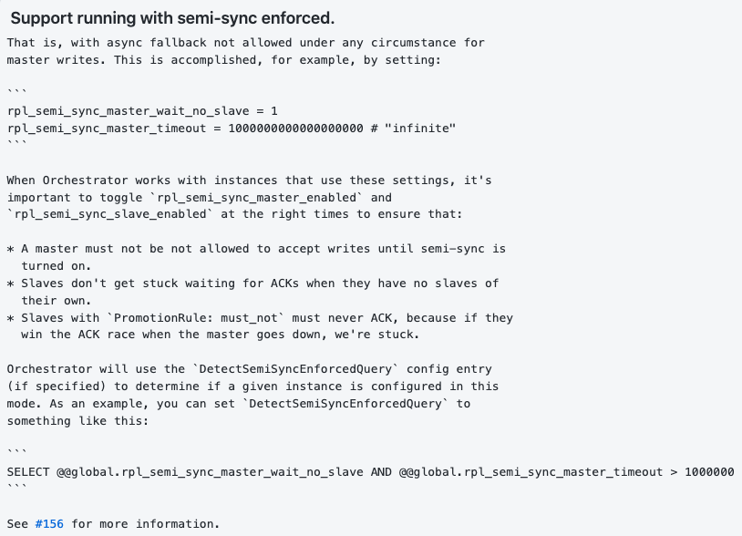

也就是说, 在任何情况下都不允许退化为异步复制. 这可以通过设置来实现, 比如说:

```javascript
rpl_semi_sync_master_wait_no_slave = 1
rpl_semi_sync_master_timeout = 100000000000000 # "无限大"
```
当 Orchestrator 与使用这些设置的实例一起工作时, 在正确的时间切换`rpl_semi_sync_master_enabled`和`rpl_semi_sync_slave_enabled` 是很重要的. 目的是确保:

* 在半同步打开之前, 主库不能接受写请求
>   A master must not be not allowed to accept writes until semi-sync is turned on.
* 当从库没有自己的从库时, 他不会因为自己开启了`rpl_semi_sync_master_enabled` 而导致复制应用卡住
> A master must not be not allowed to accept writes until semi-sync is turned on.
* 带有`PromotionRule: must_not`的从库决不能有ACK, 因为如果他们赢得ACK竞赛, 那么在主库故障时我们就会被卡住
> Slaves with \`PromotionRule: must\_not\` must never ACK, because if they win the ACK race when the master goes down, we're stuck.

Orchestrator将使用`DetectSemiSyncEnforcedQuery`配置项（如果指定的话来确定一个给定的实例是否被配置在这种模式. 作为一个例子, 你可以把`DetectSemiSyncEnforcedQuery`设置为

```javascript
SELECT @@global.rpl_semi_sync_master_wait_no_slave AND @@global.rpl_semi_sync_master_timeout > 1000000
```
## SupportFuzzyPoolHostnames
类型: `bool`

默认值: `true`

`submit-pool-instances`命令是否应该能够传递模糊实例列表(模糊意味着non-fqdn, 但足以识别).  默认为"true", 表示后端数据库上有更多查询

> Should "submit-pool-instances" command be able to pass list of fuzzy instances (fuzzy means non-fqdn, but unique enough to recognize). Defaults 'true', implies more queries on backend db

源码`go/inst/pool.go`

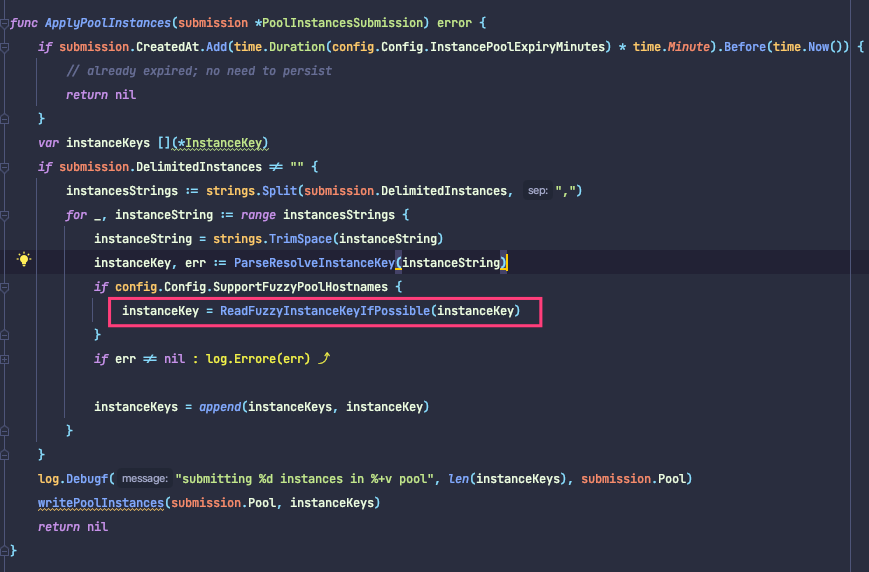

ReadFuzzyInstanceKeyIfPossible

```go
// ReadFuzzyInstanceKeyIfPossible accepts a fuzzy instance key and hopes to return a single, fully qualified,
// known instance key, or else the original given key
func ReadFuzzyInstanceKeyIfPossible(fuzzyInstanceKey *InstanceKey) *InstanceKey {
	if instanceKey := ReadFuzzyInstanceKey(fuzzyInstanceKey); instanceKey != nil {
		return instanceKey
	}
	return fuzzyInstanceKey
}
```
ReadFuzzyInstanceKey

```go
// ReadFuzzyInstanceKey accepts a fuzzy instance key and expects to return a single, fully qualified,
// known instance key.
func ReadFuzzyInstanceKey(fuzzyInstanceKey *InstanceKey) *InstanceKey {
	if fuzzyInstanceKey == nil {
		return nil
	}
	if fuzzyInstanceKey.IsIPv4() {
		// avoid fuzziness. When looking for 10.0.0.1 we don't want to match 10.0.0.15!
		return nil
	}
	if fuzzyInstanceKey.Hostname != "" {
		// Fuzzy instance search
		if fuzzyInstances, _ := findFuzzyInstances(fuzzyInstanceKey); len(fuzzyInstances) == 1 {
               // findFuzzyInstances 有结果, 且结果只有一个才行
			return &(fuzzyInstances[0].Key)
		}
	}
	return nil
}
```
findFuzzyInstances

```go
// findFuzzyInstances return instances whose names are like the one given (host & port substrings)
// For example, the given `mydb-3:3306` might find `myhosts-mydb301-production.mycompany.com:3306`
func findFuzzyInstances(fuzzyInstanceKey *InstanceKey) ([](*Instance), error) {
	condition := `
		hostname like concat('%%', ?, '%%')
		and port = ?
	`
	return readInstancesByCondition(condition, sqlutils.Args(fuzzyInstanceKey.Hostname, fuzzyInstanceKey.Port), `replication_depth asc, num_slave_hosts desc, cluster_name, hostname, port`)
}
```
继续看`readInstancesByCondition` 发现查的是`database_instance` 表.  已注释中的例子就是

```javascript
select xxx from database_instance where hostname like '%mydb-3%' and port=3306
```
`submit-pool-instances` 命令作用, 在command\_help.go中有描述(官方文档没描述)

```javascript
  Submit a pool name with a list of instances in that pool. This removes any previous instances associated with that pool. Expecting comma delimited list of instances

  orchestrator -c submit-pool-instances --pool name_of_pool -i pooled.instance1.com,pooled.instance2.com:3306,pooled.instance3.com
```
这个`pool` 是个什么概念?

## InstancePoolExpiryMinutes
类型: `uint`

默认值: `60`

database\_instance\_pool中的条目过期的时间(通过 `submit-pool-instance` 重新提交).

> Time after which entries in database\_instance\_pool are expired (resubmit via \`submit-pool-instances\`)

有两个地方用到这个参数:

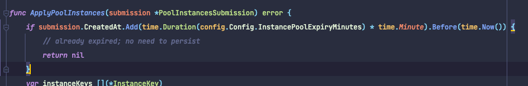

```go
// ExpirePoolInstances cleans up the database_instance_pool table from expired items
func ExpirePoolInstances() error {
	_, err := db.ExecOrchestrator(`
			delete
				from database_instance_pool
			where
				registered_at < now() - interval ? minute
			`,
		config.Config.InstancePoolExpiryMinutes,
	)
	return log.Errore(err)
}
```
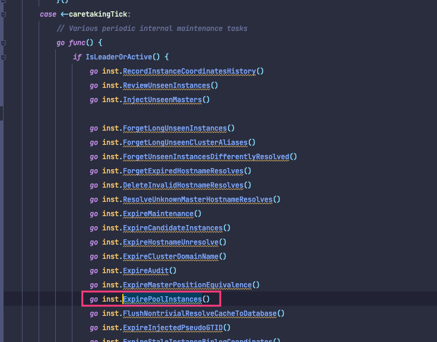

这是一个定时任务了(通过time.Tick). 每隔一段时间会执行这些方法.

## PromotionIgnoreHostnameFilters
类型: ` []string`

默认值: `[]string{}`  在配置文件里配置一个列表

这个列表匹配的主机不会被提升为主库, 列表内容可以是:

* An IP address, in which case we compare exact value
* Any other string, in which case we compare via regular expression

> Orchestrator will not promote replicas with hostname matching pattern (via -c recovery; for example, avoid promoting dev-dedicated machines)

源码`go/inst/instance_topology.go`

```go
func IsBannedFromBeingCandidateReplica(replica *Instance) bool {
	if replica.PromotionRule == MustNotPromoteRule {
		log.Debugf("instance %+v is banned because of promotion rule", replica.Key)
		return true
	}
	if FiltersMatchInstanceKey(&replica.Key, config.Config.PromotionIgnoreHostnameFilters) {
		return true
	}
	return false
}
```
```go
// FiltersMatchInstanceKey returns true if given instance key matches any one of given filters.
// A filter could be:
// - An IP address, in which case we compare exact value
// - Any other string, in which case we compare via regular expression
func FiltersMatchInstanceKey(instanceKey *InstanceKey, filters []string) bool {
	for _, filter := range filters {
		switch {
               // net.ParseIP尝试将给定的字符串解析为ip(返回IP类型), 否则返回nil
		case net.ParseIP(filter) != nil:
                   // 进入这个case表示传入的是ip
			// If the filter is an IP address, expect complete match.
			// This is to avoid matching 10.0.0.3 with 10.0.0.38 if we
			// were to compare via regexp
			if filter == instanceKey.Hostname { // 精确匹配
				return true
			}
		default:
                // 如果不是ip, 进入这个分支. 使用正则匹配
			if matched, _ := regexp.MatchString(filter, instanceKey.StringCode()); matched {
				return true
			}
		}
	}
	return false
}
```
## ServeAgentsHttp
类型: `bool`

默认值: `false`

生成另一个专门用于orchestrator-agent([Agents](Various/Agents.md))的HTTP接口 

> Spawn another HTTP interface dedicated for orchestrator-agent

该参数[提交记录](https://github.com/openark/orchestrator/commit/9f39f58d95a65b9a7f2a731eba452e1c1c1fda86)有如下注释

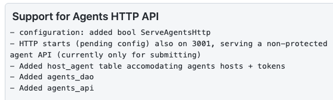

## AgentsUseSSL
类型: `bool`

默认值: `false`

When "true" orchestrator will listen on agents port with SSL as well as connect to agents via SSL

## AgentsUseMutualTLS
类型: `bool`

默认值: `false`

When "true" Use mutual TLS for the server to agent communication

## AgentSSLSkipVerify
类型: `bool`

默认值: `false`

When using SSL for the Agent, should we ignore SSL certification error

## AgentSSLPrivateKeyFile
类型: `string`

默认值: ""

 Name of Agent SSL private key file, applies only when AgentsUseSSL = true

## AgentSSLCertFile
类型: `string`

默认值: ""

Name of the Agent Certificate Authority file, applies only when AgentsUseSSL = true

## AgentSSLValidOUs
类型: `[]string`

默认值: `[]string{}`

Valid organizational units when using mutual TLS to communicate with the agents

## UseSSL
类型: `bool`

默认值: `false`

Use SSL on the server web port

## UseMutualTLS
类型: `bool`

默认值: `false`

When "true" Use mutual TLS for the server's web and API connections

## SSLSkipVerify
类型: `bool`

默认值: `false`

When using SSL, should we ignore SSL certification error

## SSLPrivateKeyFile
类型: `string`

默认值: ""

Name of SSL private key file, applies only when UseSSL = true

## SSLCertFile
类型: `string`

默认值: ""

Name of SSL certification file, applies only when UseSSL = true

## SSLCAFile
类型: `string`

默认值: ""

Name of the Certificate Authority file, applies only when UseSSL = true

## SSLValidOUs
类型: `[]string`

默认值: `[]string{}`

Valid organizational units when using mutual TLS

## StatusEndpoint
类型: `string`

默认值: `/api/status`

Override the status endpoint.  Defaults to '/api/status'

另见[Status Checks](Operation/Status%20Checks.md)

## StatusOUVerify
类型: `bool`

默认值: `false`

If true, try to verify OUs when Mutual TLS is on.  Defaults to false

## AgentPollMinutes
类型: `uint`

默认值: `60`

Minutes between agent polling

应该就是定期从agent收集数据


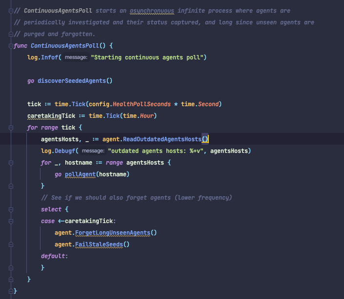

ContinuousAgentsPoll 启动一个异步无限过程，在此过程中定期调查代理并捕获它们的状态，并且很久以来看不见的代理被清除和遗忘。


## UnseenAgentForgetHours
类型: `uint`

默认值: `6`

Number of hours after which an unseen agent is forgotten


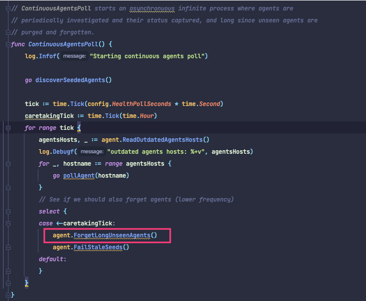

## StaleSeedFailMinutes
类型: `uint`

默认值: `60`

过时(无进展)seed被视为失败的分钟数.

> Number of minutes after which a stale (no progress) seed is considered failed.

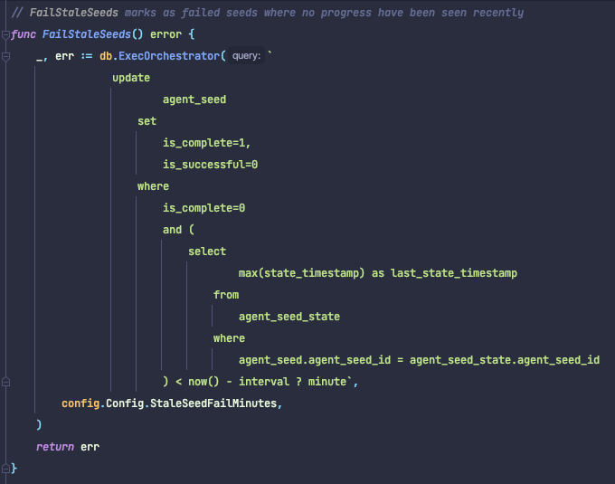

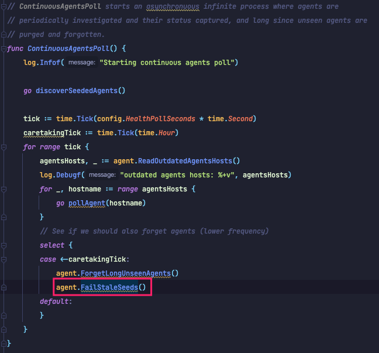

## SeedAcceptableBytesDiff
类型: `int64`

默认值: `8192`

Difference in bytes between seed source & target data size that is still considered as successful copy

没有搜到代码里哪里用到这个参数了

## SeedWaitSecondsBeforeSend
类型: `int64`

默认值: `2`

在开始向agent发送数据命令之前的等待秒数

> Number of seconds for waiting before start send data command on agent

## AutoPseudoGTID
类型: `bool`

默认值: `false`

是否像主库注入Pseudo-GTID(开了GTID就不需要开这个参数了)

> Should orchestrator automatically inject Pseudo-GTID entries to the masters

关于Pseudo-GTID, 把这几篇文章看懂就好了

* [http://code.openark.org/blog/mysql/pseudo-gtid](http://code.openark.org/blog/mysql/pseudo-gtid)
* [http://code.openark.org/blog/mysql/pseudo-gtid-row-based-replication](http://code.openark.org/blog/mysql/pseudo-gtid-row-based-replication)
* [http://code.openark.org/blog/mysql/refactoring-replication-topology-with-pseudo-gtid](http://code.openark.org/blog/mysql/refactoring-replication-topology-with-pseudo-gtid)
* [http://code.openark.org/blog/mysql/pseudo-gtid-ascending](http://code.openark.org/blog/mysql/pseudo-gtid-ascending)

另见[Configuration: Discovery, Pseudo-GTID](Setup/配置/Configuration%20%20Discovery%2C%20Pseudo-GTID.md)

## PseudoGTIDPattern
类型: `string`

默认值: `""` 如果开了[[AutoPseudoGTID id=112feef8-f2b2-4612-856d-fb4f76ab2a73]]则是`"drop view if exists `_pseudo_gtid_`"`

看这篇文章[http://code.openark.org/blog/mysql/pseudo-gtid-row-based-replication](http://code.openark.org/blog/mysql/pseudo-gtid-row-based-replication) 就懂了

> Pattern to look for in binary logs that makes for a unique entry (pseudo GTID). When empty, Pseudo-GTID based refactoring is disabled.

源码`config.go`

```go
func (this *Configuration) postReadAdjustments() error {
    ...
    if this.AutoPseudoGTID {
        this.PseudoGTIDPattern = "drop view if exists `_pseudo_gtid_`"
        this.PseudoGTIDPatternIsFixedSubstring = true
        this.PseudoGTIDMonotonicHint = "asc:"
        this.DetectPseudoGTIDQuery = SelectTrueQuery
    }
```
## PseudoGTIDPatternIsFixedSubstring
类型: `bool`

默认值: `false` 如果开了[[AutoPseudoGTID id=112feef8-f2b2-4612-856d-fb4f76ab2a73]]则是`true`

如果为`true` , [[PseudoGTIDPattern id=112feef8-f2b2-4612-856d-fb4f76ab2a73]] 会被视为字符串而非正则表达式, 可以缩短搜索时间

> If true, then PseudoGTIDPattern is not treated as regular expression but as fixed substring, and can boost search time

源码`go/inst/instance_binlog_dao.go`

```go
func compilePseudoGTIDPattern() (pseudoGTIDRegexp *regexp.Regexp, err error) {
	log.Debugf("PseudoGTIDPatternIsFixedSubstring: %+v", config.Config.PseudoGTIDPatternIsFixedSubstring)
	if config.Config.PseudoGTIDPatternIsFixedSubstring {
		return nil, nil
	}
	log.Debugf("Compiling PseudoGTIDPattern: %q", config.Config.PseudoGTIDPattern)
	return regexp.Compile(config.Config.PseudoGTIDPattern)
}

// pseudoGTIDMatches attempts to match given string with pseudo GTID pattern/text.
func pseudoGTIDMatches(pseudoGTIDRegexp *regexp.Regexp, binlogEntryInfo string) (found bool) {
	if config.Config.PseudoGTIDPatternIsFixedSubstring {
		return strings.Contains(binlogEntryInfo, config.Config.PseudoGTIDPattern)
	}
	return pseudoGTIDRegexp.MatchString(binlogEntryInfo)
}
```
## PseudoGTIDMonotonicHint
类型: `string`

默认值: `""` 如果开了[[AutoPseudoGTID id=112feef8-f2b2-4612-856d-fb4f76ab2a73]]则是`asc:`

Pseudo-GTID 条目中的子字符串, 指示 Pseudo-GTID 条目预计单调递增

> subtring in Pseudo-GTID entry which indicates Pseudo-GTID entries are expected to be monotonically increasing

看这篇文章[http://code.openark.org/blog/mysql/pseudo-gtid-ascending](http://code.openark.org/blog/mysql/pseudo-gtid-ascending)

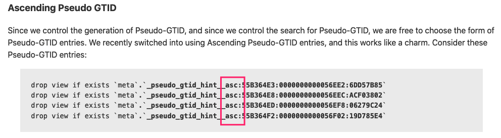

## DetectPseudoGTIDQuery
类型: `string`

默认值: `""` 如果开了[[AutoPseudoGTID id=112feef8-f2b2-4612-856d-fb4f76ab2a73]]则是`"select 1"`

可选查询, 用于权威地决定是否在实例上启用伪 gtid. 

> 译者注: 只有在你想自己注入Pseudo-GTID时 才需要设置这个参数. 详见[[Manual Pseudo-GTID injection id=f65504cf-f002-4cc4-beb7-acfac2b125c6]]

> Optional query which is used to authoritatively decide whether pseudo gtid is enabled on instance

另见[[Manual Pseudo-GTID injection id=f65504cf-f002-4cc4-beb7-acfac2b125c6]].

## BinlogEventsChunkSize
类型: `int`

默认值: `10000`

SHOW BINLOG|RELAYLOG EVENTS LIMIT ?,X语句的块大小(X). 更小意味着更少的锁定和更多的工作要做

> Chunk size (X) for SHOW BINLOG|RELAYLOG EVENTS LIMIT ?,X statements. Smaller means less locking and mroe work to be done

## SkipBinlogEventsContaining
类型: `[]string`

默认值: `[]string{}`

当scanning/comparing Pseudo-GTID的binlog时, 跳过包含给定文本的条目. 这些不是正则表达式(在扫描二进制日志时会消耗太多 CPU), 只是要查找的substrings.

> When scanning/comparing binlogs for Pseudo-GTID, skip entries containing given texts. These are NOT regular expressions (would consume too much CPU while scanning binlogs), just substrings to find.

源码`go/inst/instance_binlog.go`

```go
// NextRealEvent returns the next event from binlog that is not meta/control event (these are start-of-binary-log,
// rotate-binary-log etc.)
func (this *BinlogEventCursor) nextRealEvent(recursionLevel int) (*BinlogEvent, error) {
	if recursionLevel > maxEmptyEventsEvents {
		log.Debugf("End of real events")
		return nil, nil
	}
	event, err := this.nextEvent(0)
	if err != nil {
		return event, err
	}
	if event == nil {
		return event, err
	}

	if _, found := skippedEventTypes[event.EventType]; found {
		// Recursion will not be deep here. A few entries (end-of-binlog followed by start-of-bin-log) are possible,
		// but we really don't expect a huge sequence of those.
		return this.nextRealEvent(recursionLevel + 1)
	}
	for _, skipSubstring := range config.Config.SkipBinlogEventsContaining {
		if strings.Index(event.Info, skipSubstring) >= 0 {
			// Recursion might go deeper here.
			return this.nextRealEvent(recursionLevel + 1)
		}
	}
	event.NormalizeInfo()
	return event, err
}
```
## ReduceReplicationAnalysisCount
类型: `bool`

默认值: `true`

官方文档没有描述这个参数.

> When true, replication analysis will only report instances where possibility of handled problems is possible in the first place (e.g. will not report most leaf nodes, that are mostly uninteresting). When false, provides an entry for every known instance

TODO 不是很理解这个参数.  原密码判断这个参数开启时会在查询增加一个子句. 很复杂, 暂时懒得看了

## FailureDetectionPeriodBlockMinutes
类型: `int`

默认值: `60`

`orchestrator`每秒钟运行一次检测

`FailureDetectionPeriodBlockMinutes`是一种反垃圾邮件机制, 它可以阻止`orchestrator`一次又一次地通知同一检测.

> The time for which an instance's failure discovery is kept "active", so as to avoid concurrent "discoveries" of the instance's failure; this preceeds any recovery process, if any.

另见[Configuration: Failure detection](Setup/配置/Configuration%20%20Failure%20detection.md)

## RecoveryPeriodBlockMinutes
类型: `int`

默认值: `60`

一个实例的恢复保持 "active "的时间, 以避免在同一实例上同时进行恢复.

> (supported for backwards compatibility but please use newer \`RecoveryPeriodBlockSeconds\` instead) The time for which an instance's recovery is kept "active", so as to avoid concurrent recoveries on same instance as well as flapping

这个参数被RecoveryPeriodBlockSecond取代了. 在`config.go` 中

```go
    if this.RecoveryPeriodBlockSeconds == 0 && this.RecoveryPeriodBlockMinutes > 0 {
        // RecoveryPeriodBlockSeconds is a newer addition that overrides RecoveryPeriodBlockMinutes
        // The code does not consider RecoveryPeriodBlockMinutes anymore, but RecoveryPeriodBlockMinutes
        // still supported in config file for backwards compatibility
        this.RecoveryPeriodBlockSeconds = this.RecoveryPeriodBlockMinutes * 60
    }
```
如果`RecoveryPeriodBlockSeconds`为0, 且RecoveryPeriodBlockMinutes>0. 那么会设置RecoveryPeriodBlockSeconds=RecoveryPeriodBlockMinutes \* 60

其他代码中没有再使用`RecoveryPeriodBlockMinutes` 而是使用`RecoveryPeriodBlockSeconds` 

## RecoveryPeriodBlockSeconds
类型: `int`

默认值: `3600`

一个实例的恢复保持 "active "的时间, 以避免在同一实例上同时进行恢复.

> (overrides \`RecoveryPeriodBlockMinutes\`) The time for which an instance's recovery is kept "active", so as to avoid concurrent recoveries on same instance as well as flapping

源码`go/logic/topology_recovery_dao.go`

```go
// ClearActiveRecoveries clears the "in_active_period" flag for old-enough recoveries, thereby allowing for
// further recoveries on cleared instances.
func ClearActiveRecoveries() error {
	_, err := db.ExecOrchestrator(`
			update topology_recovery set
				in_active_period = 0,
				end_active_period_unixtime = UNIX_TIMESTAMP()
			where
				in_active_period = 1
				AND start_active_period < NOW() - INTERVAL ? SECOND
			`,
		config.Config.RecoveryPeriodBlockSeconds,
	)
	return log.Errore(err)
}
```
## RecoveryIgnoreHostnameFilters
类型: `[]string`

默认值: `[]string{}`

Recovery analysis会忽略这个列表中指定的主机

> Recovery analysis will completely ignore hosts matching given patterns

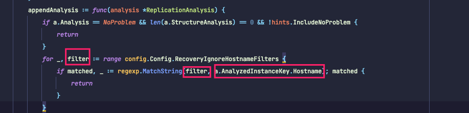

注意, 是主机名, 所以多实例部署情况需要考虑好

## RecoverMasterClusterFilters
类型: `[]string`

默认值: `[]string{}`

只对列表中正则表达式匹配的集群做故障恢复操作(当然 ".\*" 匹配所有集群)

> Only do master recovery on clusters matching these regexp patterns (of course the ".\*" pattern matches everything)

另见[Configuration: Recovery](Setup/配置/Configuration%20%20Recovery.md)

## RecoverIntermediateMasterClusterFilters
类型: `[]string`

默认值: `[]string{}`

只对列表中正则表达式匹配的IntermediateMaster做故障恢复操作(当然 ".\*" 匹配所有集群)

> Only do IM recovery on clusters matching these regexp patterns (of course the ".\*" pattern matches everything)

## ProcessesShellCommand
类型: `string`

默认值: `bash`

执行命令脚本的Shell

> Shell that executes command scripts

## OnFailureDetectionProcesses
类型: `[]string`

默认值: `[]string{}`

当FailureDetection发现故障时, 调用的钩子列表. 详见[[Hooks id=4124be88-14f6-4c3a-87c8-f4bb76e0b692]] 

> Processes to execute when detecting a failover scenario (before making a decision whether to failover or not). May and should use some of these placeholders: {failureType}, {instanceType}, {isMaster}, {isCoMaster}, {failureDescription}, {command}, {failedHost}, {failureCluster}, {failureClusterAlias}, {failureClusterDomain}, {failedPort}, {successorHost}, {successorPort}, {successorAlias}, {countReplicas}, {replicaHosts}, {isDowntimed}, {autoMasterRecovery}, {autoIntermediateMasterRecovery}

故障列表详见[[Failure detection scenarios 故障检测场景 id=78787f6a-1f80-4d86-a3ba-e1a0e5993eae]] 

placeholders列表详见[Configuration: Recovery](Setup/配置/Configuration%20%20Recovery.md)

## PreGracefulTakeoverProcesses
类型: `[]string`

默认值: `[]string{}`

在计划中的、优雅的主库接管时, 在主库进入只读状态之前立即执行的钩子列表.

> Processes to execute before doing a failover (aborting operation should any once of them exits with non-zero code; order of execution undefined). May and should use some of these placeholders: {failureType}, {instanceType}, {isMaster}, {isCoMaster}, {failureDescription}, {command}, {failedHost}, {failureCluster}, {failureClusterAlias}, {failureClusterDomain}, {failedPort}, {successorHost}, {successorPort}, {countReplicas}, {replicaHosts}, {isDowntimed}

## PreFailoverProcesses
类型: `[]string`

默认值: `[]string{}`

采取恢复行动之前立即执行的钩子列表. 任何这些进程的失败（非零退出代码）都会中止恢复. 提示: 这让你有机会根据系统的一些内部状态中止恢复.

> Processes to execute before doing a failover (aborting operation should any once of them exits with non-zero code; order of execution undefined). May and should use some of these placeholders: {failureType}, {instanceType}, {isMaster}, {isCoMaster}, {failureDescription}, {command}, {failedHost}, {failureCluster}, {failureClusterAlias}, {failureClusterDomain}, {failedPort}, {countReplicas}, {replicaHosts}, {isDowntimed}

## PostFailoverProcesses
类型: `[]string`

默认值: `[]string{}`

在任何成功恢复结束时执行的钩子列表.

> Processes to execute after doing a failover (order of execution undefined). May and should use some of these placeholders: {failureType}, {instanceType}, {isMaster}, {isCoMaster}, {failureDescription}, {command}, {failedHost}, {failureCluster}, {failureClusterAlias}, {failureClusterDomain}, {failedPort}, {successorHost}, {successorPort}, {successorBinlogCoordinates}, {successorAlias}, {countReplicas}, {replicaHosts}, {isDowntimed}, {isSuccessful}, {lostReplicas}, {countLostReplicas}

## PostUnsuccessfulFailoverProcesses
类型: `[]string`

默认值: `[]string{}`

在任何不成功的恢复结束时执行的钩子列表

> Processes to execute after a not-completely-successful failover (order of execution undefined). May and should use some of these placeholders: {failureType}, {instanceType}, {isMaster}, {isCoMaster}, {failureDescription}, {command}, {failedHost}, {failureCluster}, {failureClusterAlias}, {failureClusterDomain}, {failedPort}, {successorHost}, {successorPort}, {successorBinlogCoordinates}, {successorAlias}, {countReplicas}, {replicaHosts}, {isDowntimed}, {isSuccessful}, {lostReplicas}, {countLostReplicas}

## PostMasterFailoverProcesses
类型: `[]string`

默认值: `[]string{}`

在主库恢复成功后执行的钩子列表

> Processes to execute after doing a master failover (order of execution undefined). Uses same placeholders as PostFailoverProcesses

## PostIntermediateMasterFailoverProcesses
类型: `[]string`

默认值: `[]string{}`

在intermediate master恢复成功后执行的钩子列表

> Processes to execute after doing a intermediate master failover (order of execution undefined). Uses same placeholders as PostFailoverProcesses

## PostGracefulTakeoverProcesses
类型: `[]string`

默认值: `[]string{}`

在计划中的、优雅的主库接管时, 在就主库作为新主库从库后执行的钩子列表

> Processes to execute after runnign a graceful master takeover. Uses same placeholders as PostFailoverProcesses

## PostTakeMasterProcesses
类型: `[]string`

默认值: `[]string{}`

官方文档没有描述这个参数. 根据中[https://github.com/openark/orchestrator/pull/859](https://github.com/openark/orchestrator/pull/859) 可以看出这个参数是在2019年加的.

注释的意思是, 在Take-Master成功后执行的钩子列表

> Processes to execute after a successful Take-Master event has taken place

那么就要看Take-Master是什么了

在`go/app/command_help.go` 中有如下描述

```javascript
  Turn an instance into a master of its own master; essentially switch the two. Replicas of each of the two
  involved instances are unaffected, and continue to replicate as they were.
  The instance's master must itself be a replica. It does not necessarily have to be actively replicating.

  orchestrator -c take-master -i replica.that.will.switch.places.with.its.master.com
```
把一个实例变成它自己的master的master;  本质上是切换两者.  两个涉及的实例中的每一个的副本都不受影响, 并继续照原样复制.

这个实例的master本身必须也是一个从库. 它是不是actively replicating不重要.

我的理解是这样的

```javascript
A --> B --> C           A --> C --> B
      |     |                 |     |
      ∨     ∨     ->          ∨     ∨
      D     E                 E     D
```
在源码`go/inst/instance_topology.go` 也有注释

```javascript
// TakeMaster will move an instance up the chain and cause its master to become its replica.
// It's almost a role change, just that other replicas of either 'instance' or its master are currently unaffected
// (they continue replicate without change)
// Note that the master must itself be a replica; however the grandparent does not necessarily have to be reachable
// and can in fact be dead.
func TakeMaster(instanceKey *InstanceKey, allowTakingCoMaster bool) (*Instance, error) {
```
## RecoverNonWriteableMaster
类型: `bool`

默认值: `false`

如果为true, 则orchestrator认为只读状态的主库处于故障场景, 会将主库变为可写状态

> When 'true', orchestrator treats a read-only master as a failure scenario and attempts to make the master writeable

这个PR [https://github.com/openark/orchestrator/pull/1332](https://github.com/openark/orchestrator/pull/1332) 已经说的很清楚了, 英文也很简单, 没必要翻译了

```javascript
Fixes #1328

Replaces #1330

This PR introduces RecoverNonWriteableMaster, bool, defaults false for backward compatibility. If enabled, then a scenario where a cluster's primary is found to be read-only is treated as a failure analysis: we reuse NoWriteableMasterStructureWarning given some additional constraints.

Furthermore, when RecoverNonWriteableMaster is enabled, then NoWriteableMasterStructureWarning is an actionable failure, and orchestrator proceeds to run a recovery. The recovery is to disable read_only (and super_read_only, assuming UseSuperReadOnly is also enabled).

Note master terminology is subject to change in a future major release.
```
## CoMasterRecoveryMustPromoteOtherCoMaster
类型: `bool`

默认值: `true`

这是双主的场景. 如果一个主库故障, 当该参数为`true`时, 只会提升另一个"主库"为新主库(看起来怪怪的), 否则集群中所有节点都可能提升为新主库.

> When 'false', anything can get promoted (and candidates are prefered over others). When 'true', orchestrator will promote the other co-master or else fail

## DetachLostSlavesAfterMasterFailover
类型: `bool`

默认值: `true`

这个参数是`DetachLostReplicasAfterMasterFailover` 的同义词

源码`config.go` 中

```go
    {
        if this.DetachLostSlavesAfterMasterFailover {
            this.DetachLostReplicasAfterMasterFailover = true
        }
    }
```
## DetachLostReplicasAfterMasterFailover
类型: `bool`

默认值: `true`  因为DetachLostSlavesAfterMasterFailover默认是true

直译: 在主库恢复中不会丢失的副本(即比选举出的新主库拥有更新数据的从库)是否应该被强行分离？

> Should replicas that are not to be lost in master recovery (i.e. were more up-to-date than promoted replica) be forcibly detached

在[Configuration: Recovery](Setup/配置/Configuration%20%20Recovery.md)中有如下描述

[[DetachLostReplicasAfterMasterFailover : 一些从库在恢复过程中可能会丢失. 如果该参数为true, orchestrator将通过detach-replica命令强行中断它们的复制, 以确保没有人认为它们是正常的. id=1e244518-4a10-46c4-81b5-2da1c8998295]] 

英文原文是:

some replicas may get lost during recovery. When `true`, `orchestrator` will forcibly break their replication via `detach-replica` command to make sure no one assumes they're at all functional.

这个官方文档和代码注释让人无语.. 感觉说的都不是一个东西

只能看源码了. 在`go/logic/topology_recovery.go` 的`recoverDeadMaster` 函数中有如下定义

```go
	if promotedReplica != nil && len(lostReplicas) > 0 && config.Config.DetachLostReplicasAfterMasterFailover {
		postponedFunction := func() error {
			AuditTopologyRecovery(topologyRecovery, fmt.Sprintf("RecoverDeadMaster: lost %+v replicas during recovery process; detaching them", len(lostReplicas)))
			for _, replica := range lostReplicas {
				replica := replica
				inst.DetachReplicaMasterHost(&replica.Key)
			}
			return nil
		}
		topologyRecovery.AddPostponedFunction(postponedFunction, fmt.Sprintf("RecoverDeadMaster, detach %+v lost replicas", len(lostReplicas)))
	}
```
如果成功选举除了新主库, 且有lostReplicas, 且DetachLostReplicasAfterMasterFailover为true. 

那么循环lostReplicas, 逐一执行DetachReplicaMasterHost

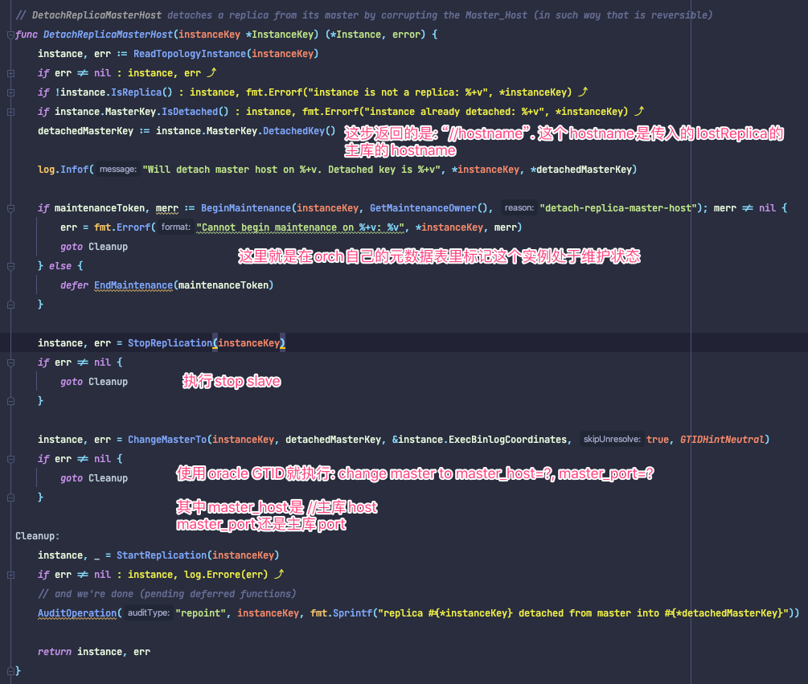

因为主库host变成了"//{host}". 所以肯定是连不上的. 但这个操作是可逆的, 以后你想在做操作也好做

还有个问题`lostReplicas` 是如何定义的呢?

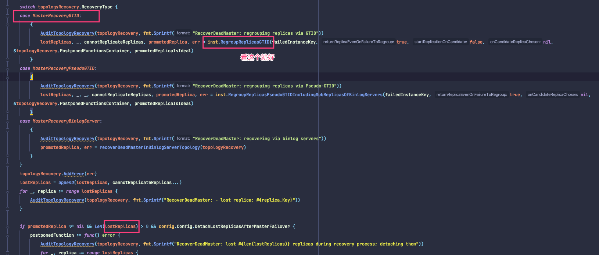

层层嵌套, 继续..

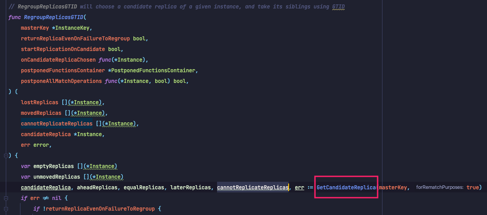

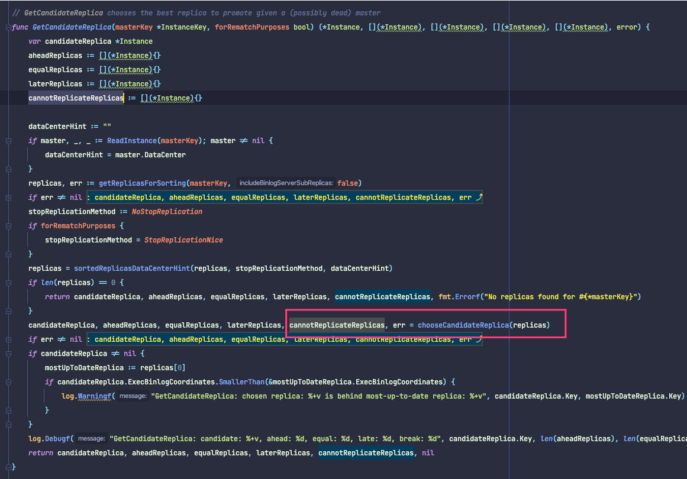

chooseCandidateReplica

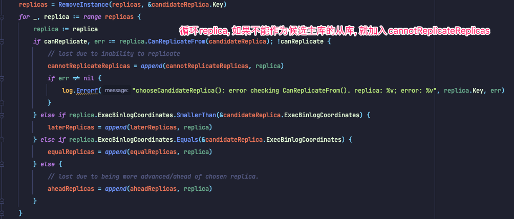

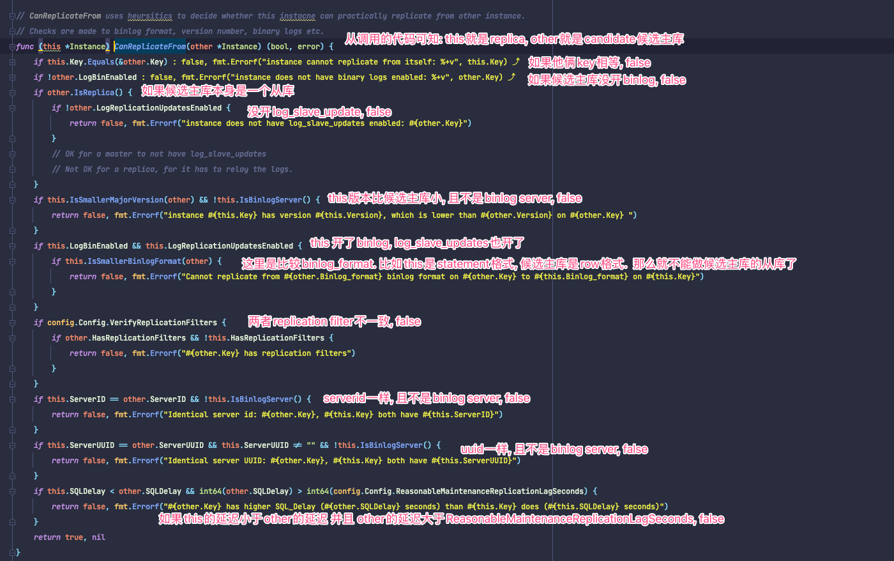

> [[ReasonableReplicationLagSeconds id=509ce608-cd95-4ec4-9fbd-02f8e01e6ca2]] 

所以如果有与上面的原因, 导致从库变为`lostReplica` , 那么会使用`change master to master_host="//主库"` 的方式让他处于复制异常状态.


