# Using the Web interface
# [Using the Web interface](https://github.com/openark/orchestrator/blob/master/docs/using-the-web-interface.md)
以下假设您已作为 Web/API 服务执行. 打开浏览器并将其定向到 `http://your.host:3000`. 如果一切顺利, 您应该会看到以下欢迎页面:

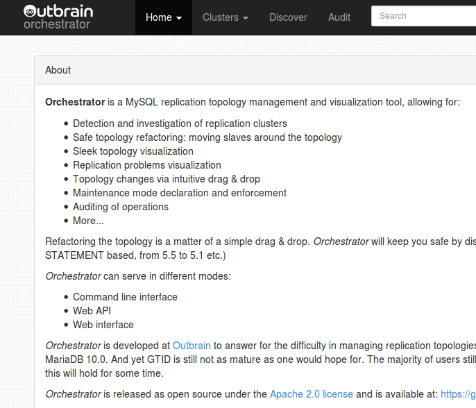

如果这是你第一次使用orchestrator, 那么你应该从教它开始. `orchestrator`需要知道你有哪些复制拓扑结构. Web界面通过`discover`页面提供了这一点.

在每个复制拓扑中, 选择一个server（可以是master或slave）, 并让`orchestrator`知道这个server侦听的hostname & port. `Orchestrator`将递归地向上和向下钻取复制以映射整个拓扑. 这可能需要几分钟的时间, 在此期间, `orchestrator`会将它遇到的服务器连接到子拓扑中, 并最终形成最终的拓扑结构.

您可以手动输入任意数量的服务器（在拓扑结构内部或外部）. `orchestrator`第一次调查时, 它只能接触到当前正在复制的那些副本. 因此,  如果你知道你有一些复制是暂时关闭的, 你需要手动添加它们, 或者, 如果你喜欢看到自动化的工作, 就等着它们起来, 那时`orchestrator`会自动找到它们.

>  一旦`orchestrator`熟悉了一个server, 它就不会关心该服务器是否滞后、不复制或无法访问了。该服务器仍然是它最后被看到的拓扑结构的一部分。这方面有一个超时：如果一个服务器在UnseenInstanceForgetHours小时内没有被看到，它就会被自动遗忘（推定为死亡）。同样，如果它突然复活，并连接到一个已知的拓扑结构，它会被自动重新发现。

`Orchestrator` 对它得到的每个输入的CNAME进行解析, 无论是从用户还是从复制拓扑结构本身. 这是为了避免歧义或隐含的重复

>  `Orchestrator` resolves the `CNAME` of every input it gets, either from the user or from the replication topology itself. This is for avoiding ambiguities or implicit duplicates.

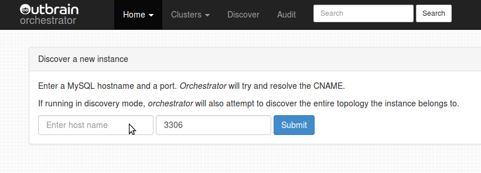

一旦`orchestrator`熟悉了一个拓扑结构, 你就可以通过集群页面查看和操作它. 点击导航栏上的群集下拉菜单, 可以看到可用的群集.

>  每个拓扑结构都与一个集群名称相关联, 该名称（目前）以拓扑结构的主站命名

集群页面是最有趣的地方. `Orchestrator`以一个基于D3小工具的、易于理解的树状信息图来展示集群. 子树是可折叠的

树中的每个节点都呈现一个单一的MySQL实例, 列出其fully qualified name、其版本、二进制日志格式和复制延迟.

请注意, 每个服务器的右边都有一个设置图标. 点击这个图标可以打开一个模式, 里面有关于该服务器的一些额外信息以及要执行的操作

该模式允许你开始/结束实例的维护模式; 执行立即刷新（默认情况下, 实例每分钟轮询一次 -- 这是可以配置的）; 停止/启动复制; 忘记实例（如果仍然连接到拓扑结构, 一分钟后可能被重新发现）

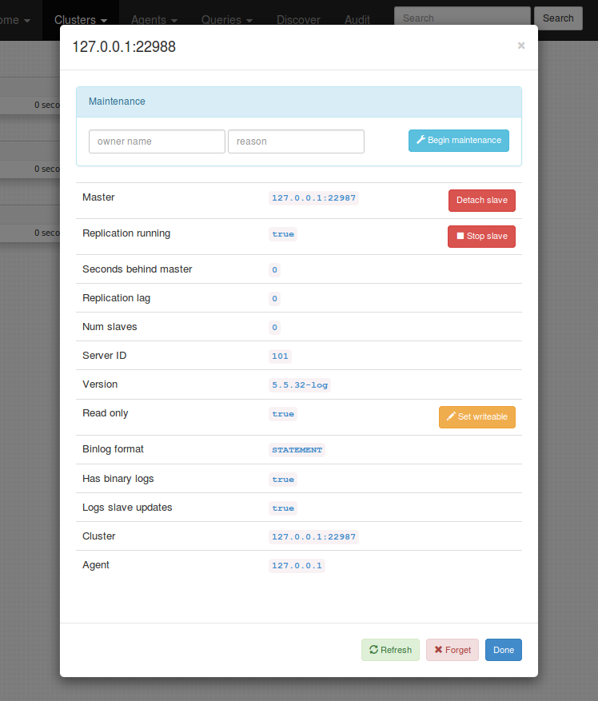

拓扑结构可以被重构: 复制体可以通过拖放来移动. 开始拖动一个实例: 所有可能的可拖动目标立即被染成绿色. 你可以把你的实例变成所有可拖放目标的副本.

Master-master 拓扑可以通过将一个 master 拖到它的一个副本上来创建, 使两个节点都成为共同的主节点.

复杂的重构是通过执行多个这样的步骤来完成的. 您可能需要将实例拖放三到四次才能将其放置在“远程”位置.

>  Complex refactoring is done by performing multiple such steps. You may need to drag and drop your instance three or four times to put it in a "remote" location.

当实例或其目标主机出现问题(延迟过多、不要复制等)时, `Orchestrator`将禁止删除实例, 从而保证您的安全. 如果它发现更深层次的障碍, 例如目标没有二进制日志, 它可能会允许drop操作, 但仍然会中止操作.

Begin dragging: possible targets colored green

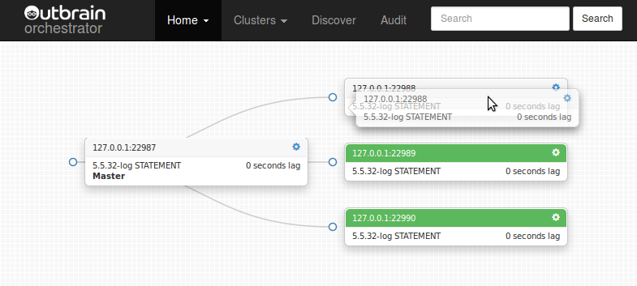

Move over your target and drop:

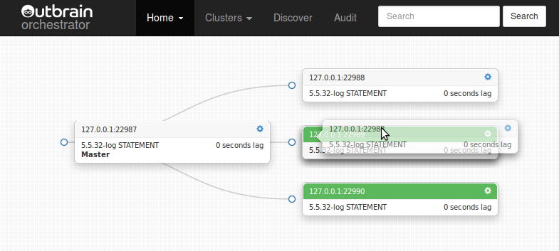

拓扑结构得到重构

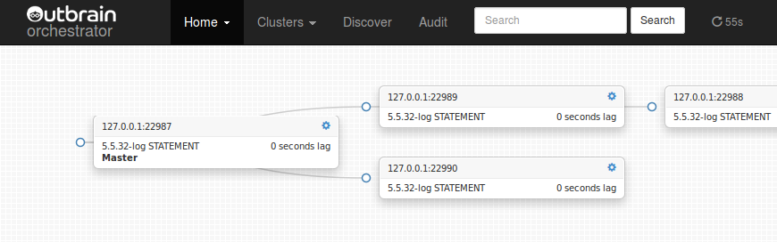

将一个主站拖到它的副本上, 就会形成一个共双主的拓扑结构

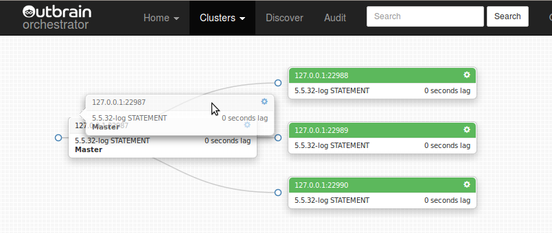

双主拓扑

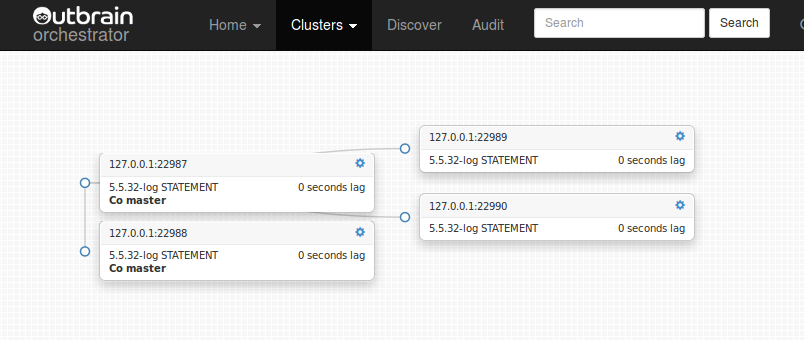

`Orchestrator`直观地显示复制和可访问性相关的问题: 复制滞后、复制不工作、实例长时间不被访问、实例访问失败、实例正在维护

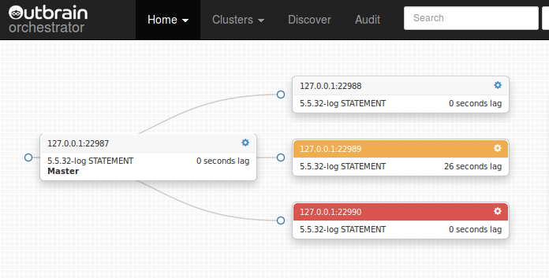

*Problems*下拉菜单在所有页面上都可用, 并显示所有拓扑结构中的所有当前已知问题:

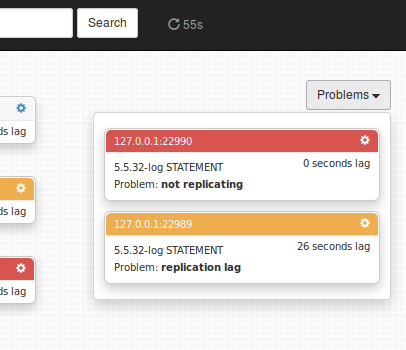

`Audit`审计页面显示了通过`orchestrator`采取的所有行动: 副本移动、检测、维护等. (START SLAVE和STOP SLAVE目前没有被审计).

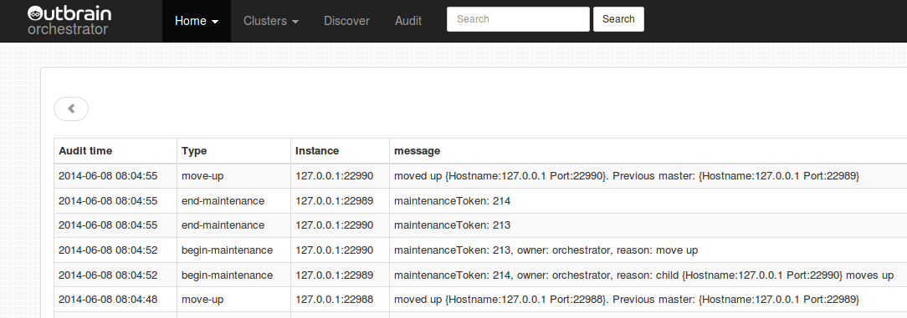

